# HPE Nonstop IDE Software for VS Code

### Abstract

This manual describes how to use the HPE Nonstop IDE Software for VS Code for developing Nonstop applications in Visual Studio Code. It supplements Visual Studio Code and Microsoft C/C++ Extension documentation, providing information specific to Nonstop development, building, deploying, and debugging.

**Published** : October 2026

### Notices

© Copyright 2026 Hewlett Packard Enterprise Development LP

### Supported Extension Versions

This guide covers HPE Nonstop IDE Software for VS Code version 1.0.0 and later. For information about supported Visual Studio Code versions, see the extension's marketplace page or the Prerequisites section in the README.

### Intended Audience

This guide is intended for developers who are familiar with Visual Studio Code and have experience with C/C++ development. It is particularly useful for those migrating from the Nonstop Development Environment for Eclipse (NSDEE) or working with existing Nonstop codebases.

### New and Changed Information in this Manual

- **Version 1.0.0**: Initial release of the user guide, covering basic project creation, configuration, building, deployment and debugging features.


---

## Table of Contents

- [Introduction](#introduction)
- [Getting Started](#getting-started)
  - [Prerequisites](#prerequisites)
    - [Required Software](#required-software)
    - [Installation](#installation)
  - [Setting Up a Workspace](#setting-up-a-workspace)
  - [Setting Up Logging](#setting-up-logging)
  - [Setting Up SSH Connection Health Check](#setting-up-ssh-connection-health-check)
  - [Why we use this](#why-we-use-this)
  - [Where it helps](#where-it-helps)
  - [Key behavior](#key-behavior)
  - [Settings (HPE Nonstop)](#settings-hpe-nonstop)
  - [Important note](#important-note)
- [Nonstop Tools](#nonstop-tools)
  - [Configuring connections](#configuring-connections)
  - [Transfer Files Wizards](#transfer-files-wizards)
    - [Transfer Files to Nonstop](#transfer-files-to-nonstop)
    - [Transfer Files (from Nonstop)](#transfer-files-from-nonstop)
- [Creating Projects](#creating-projects)
  - [Creating a Project from Scratch](#creating-a-project-from-scratch)
    - [Opening the Configure Project Settings Page](#opening-the-configure-project-settings-page)
    - [Initial Build Settings Page](#initial-build-settings-page)
    - [Remote Settings Page](#remote-settings-page)
  - [Creating a Project from Existing Sources](#creating-a-project-from-existing-sources)
    - [Method 2: Open an Existing Workspace (e.g., from NSDEE)](#method-2-open-an-existing-workspace-eg-from-nsdee)
    - [Method 3: Open the Parent Folder of the Project](#method-3-open-the-parent-folder-of-the-project)
    - [Opening the Configure Project Settings Page](#opening-the-configure-project-settings-page-1)
    - [Initial Build Settings Page](#initial-build-settings-page-1)
    - [Remote Settings Page](#remote-settings-page-1)
  - [Creating a SQL/MX Project from Scratch](#creating-a-sqlmx-project-from-scratch)
    - [Opening the Configure Project Settings Page](#opening-the-configure-project-settings-page-2)
    - [Initial Build Settings Page](#initial-build-settings-page-2)
    - [SQL/MX Remote Settings Page](#sqlmx-remote-settings-page)
  - [Creating a SQL/MX Project from Existing Sources](#creating-a-sqlmx-project-from-existing-sources)
    - [Opening the Configure Project Settings Page](#opening-the-configure-project-settings-page-3)
    - [Initial Build Settings Page](#initial-build-settings-page-3)
    - [SQL/MX Remote Settings Page](#sqlmx-remote-settings-page-1)
  - [Creating a SQL/MP Project from Scratch](#creating-a-sqlmp-project-from-scratch)
    - [Opening the Configure Project Settings Page](#opening-the-configure-project-settings-page-4)
    - [Initial Build Settings Page](#initial-build-settings-page-4)
    - [SQL/MP Remote Settings Page](#sqlmp-remote-settings-page)
  - [Creating a SQL/MP Project from Existing Sources](#creating-a-sqlmp-project-from-existing-sources)
    - [Opening the Configure Project Settings Page](#opening-the-configure-project-settings-page-5)
    - [Initial Build Settings Page](#initial-build-settings-page-5)
    - [SQL/MP Remote Settings Page](#sqlmp-remote-settings-page-1)
- [Editor Features: Nonstop Macros & Keywords](#editor-features-nonstop-macros-keywords)
  - [Overview](#overview)
  - [Nonstop Compiler Macros](#nonstop-compiler-macros)
    - [Automatic Configuration](#automatic-configuration)
    - [Configuration File Location](#configuration-file-location)
    - [Important: Do Not Remove Macros](#important-do-not-remove-macros)
  - [Nonstop Keywords and Language Extensions](#nonstop-keywords-and-language-extensions)
  - [Core Editor Features](#core-editor-features)
    - [Enhanced Highlighting: Nonstop Constructs and Keywords](#enhanced-highlighting-nonstop-constructs-and-keywords)
    - [Go to Definition: Navigate Functions and Variables](#go-to-definition-navigate-functions-and-variables)
    - [Hover Information: Instant Documentation and Type Info](#hover-information-instant-documentation-and-type-info)
    - [Error Resolution for Nonstop Macros](#error-resolution-for-nonstop-macros)
      - [Improved Macro Handling in the Editor](#improved-macro-handling-in-the-editor)
  - [Embedded SQL Support](#embedded-sql-support)
  - [Automatic Setup](#automatic-setup)
  - [Integration with Microsoft C/C++ Extension Pack](#integration-with-microsoft-cc-extension-pack)
  - [Troubleshooting](#troubleshooting)
- [Makefile Template Generation](#makefile-template-generation)
  - [Template for C Projects](#template-for-c-projects)
  - [Template for C++ Projects](#template-for-c-projects-1)
  - [Template for Both C and C++ Projects](#template-for-both-c-and-c-projects)
  - [Template for SQL/MX Projects](#template-for-sqlmx-projects)
  - [Template for SQL/MP Projects](#template-for-sqlmp-projects)
  - [Makefiles for Libraries](#makefiles-for-libraries)
- [Building a project](#building-a-project)
  - [Building Process](#building-process)
- [Deploying a project](#deploying-a-project)
- [Launching a Project](#launching-a-project)
  - [Procedure](#procedure)
  - [Launching a Nonstop Application from the Extension](#launching-a-nonstop-application-from-the-extension)
    - [Creating a Run Configuration](#creating-a-run-configuration)
    - [Launching an Application Using a Saved Run Configuration](#launching-an-application-using-a-saved-run-configuration)
- [Code Coverage](#code-coverage)
  - [Prerequisites](#prerequisites-1)
  - [Code Coverage Basics](#code-coverage-basics)
  - [Enabling Code Coverage](#enabling-code-coverage)
    - [Enabling Code Coverage for new projects](#enabling-code-coverage-for-new-projects)
    - [Enabling Code Coverage for existing projects](#enabling-code-coverage-for-existing-projects)
  - [Generating Code Coverage Report.](#generating-code-coverage-report)
- [Debugging a project](#debugging-a-project)
  - [Preparing to Launch a Nonstop Application for Debugging](#preparing-to-launch-a-nonstop-application-for-debugging)
  - [Creating or modifying debug configurations](#creating-or-modifying-debug-configurations)
    - [Nonstop Application debug configurations](#nonstop-application-debug-configurations)
      - [Creating a New Nonstop Application Debug Configuration](#creating-a-new-nonstop-application-debug-configuration)
      - [Modifying an Existing Nonstop Application Debug Configuration](#modifying-an-existing-nonstop-application-debug-configuration)
      - [Specifying Arguments for Nonstop Application Debug Configurations](#specifying-arguments-for-nonstop-application-debug-configurations)
      - [Specifying DEFINEs, ASSIGNs, and PARAMs for Guardian launch types](#specifying-defines-assigns-and-params-for-guardian-launch-types)
      - [Specifying Environment Variables for OSS Launch Types](#specifying-environment-variables-for-oss-launch-types)
    - [Nonstop Attach Process debug configurations](#nonstop-attach-process-debug-configurations)
      - [Creating a New Nonstop Attach Process Debug Configuration](#creating-a-new-nonstop-attach-process-debug-configuration)
      - [Modifying an Existing Nonstop Attach Process Debug Configuration](#modifying-an-existing-nonstop-attach-process-debug-configuration)
    - [Specifying Alternate Source File Locations](#specifying-alternate-source-file-locations)
      - [Adding a Local Directory](#adding-a-local-directory)
      - [Creating and Editing Path Mapping Lookups](#creating-and-editing-path-mapping-lookups)
    - [Specifying Debugger Options](#specifying-debugger-options)
    - [Debugging an Application Using a Saved Debug Configuration](#debugging-an-application-using-a-saved-debug-configuration)
  - [Using the Debug Perspective for Nonstop Applications](#using-the-debug-perspective-for-nonstop-applications)
    - [Debug Interface Overview](#debug-interface-overview)
    - [Common Debugging Tasks](#common-debugging-tasks)
      - [Debug View](#debug-view)
      - [Variables View](#variables-view)
      - [Source View](#source-view)
      - [Watch View](#watch-view)
      - [Inspecting the Stack](#inspecting-the-stack)
      - [Controlling Execution](#controlling-execution)
      - [Considerations for Attach Process Configurations](#considerations-for-attach-process-configurations)
      - [Setting Breakpoints](#setting-breakpoints)
      - [Breakpoints View](#breakpoints-view)
  - [Debugging Nonstop Applications Using Native Inspect (xInspect) Commands](#debugging-nonstop-applications-using-native-inspect-xinspect-commands)
    - [Entering Native Inspect Commands from the Debug Console](#entering-native-inspect-commands-from-the-debug-console)
  - [Native Inspect Commands Supported by the Extension](#native-inspect-commands-supported-by-the-extension)
  - [Detaching the Debugger from a Nonstop Process](#detaching-the-debugger-from-a-nonstop-process)
  - [Ending a Debugging Session](#ending-a-debugging-session)
  - [Debug Configuration Flow](#debug-configuration-flow)
- [Appendix](#appendix)
  - [Toolbar Icons](#toolbar-icons)
  - [Content Types](#content-types)
  - [Tips on setting up password free logins with Open SSH](#tips-on-setting-up-password-free-logins-with-open-ssh)
  - [HPE Nonstop IDE Software for VS Code Configuration](#hpe-nonstop-ide-software-for-vs-code-configuration)
    - [Configuration Files](#configuration-files)
    - [Commands](#commands)
    - [Debug and Run Configuration Types](#debug-and-run-configuration-types)
    - [Setting Up Required Tools and Configurations](#setting-up-required-tools-and-configurations)
      - [Configure Visual Studio Build Tools](#configure-visual-studio-build-tools)
      - [Configure Cygwin](#configure-cygwin)


---

# Introduction

The HPE Nonstop IDE Software for VS Code is an extension that integrates Nonstop Cross Compilers and xInspect with VS Code to provide a comprehensive integrated development environment (IDE) for developing, building, deploying, and debugging Nonstop C/C++ applications developed on Windows and Nonstop systems. This extension uses the Microsoft C/C++ Extension Pack for IntelliSense while providing Nonstop-specific workflows and capabilities. It is intended for use by all Nonstop application developers, enabling them to work with existing codebases as well as create new projects from scratch, with a familiar experience aligned to VS Code and NSDEE.

This extension supports local development with the ability to edit both local and remote source files, while builds are performed locally. It also enables connections to Nonstop systems for file transfer and operational tasks, including launching and debugging applications directly from VS Code.

**Key Capabilities**

- **Integrated Building and Editing: :** Build and edit applications locally (on Windows using Nonstop cross-compilers). All operations are initiated from VS Code on Windows using the HPE Nonstop IDE Software for VS Code.

- **File Transfer and Deployment: :** Securely transfer files and folders both to and from HPE Nonstop systems over SSH/SFTP, and deploy locally built Windows executables using configurable remote paths, and per-project deployment settings.

- **Application Launching:** Execute Nonstop applications from VS Code using custom run configurations.

- **Debugging:** Provides debugging support for Nonstop TNS/X applications built with HPE Nonstop IDE Software for VS Code, as well as for NSDEE-developed projects imported into VS Code. Supports both launching applications under the debugger and attaching to running processes.

- **Project Management:** Supports both template-based builds using generated Makefiles and makefile-based builds using user-provided Makefiles.

- **Code Coverage:** Enable code coverage collection using Codecov during builds, and analyze or merge the resulting coverage data with tools such as profmrg.

- **Language Support:** Provides support for C, C++, SQL/MP and SQL/MX with preprocessors.


---

# Getting Started

This chapter provides an introduction to how to use the HPE Nonstop IDE Software for VS Code, from setting up your workspace and creating projects , to build, deploy, and debug applications.

## Prerequisites

The HPE Nonstop IDE Software for VS Code supports building applications on local Windows systems. Builds occur on your Windows system using HPE Nonstop cross-compilers, with deployment and execution handled on Nonstop systems.

### Required Software

- Visual Studio Code (latest version recommended).

- Microsoft C/C++ Extension Pack for IntelliSense and build integration.

- Visual Studio Build Tools 2022 (or latest), with the C++ build tools workload**.** See steps [Configure Visual Studio Build Tools](#configure-visual-studio-build-tools)

- HPE Nonstop Cross Compilers: Required for compiling Nonstop applications on Windows (sold separately).

- Make Utility: Cygwin on Windows for make-driven builds. See steps [Configure Cygwin](#configure-cygwin)

- SQL/MX Preprocessor: For SQL/MX projects (sold separately).

### Installation

Install the extension from the VSIX Executable:

- Open VS Code.

- Go to Extensions (Ctrl+Shift+X).

- Click on the three dots.

- Click on Install from VSIX and navigate to the location where vsix executable is present.

- Select the executable and click Install.

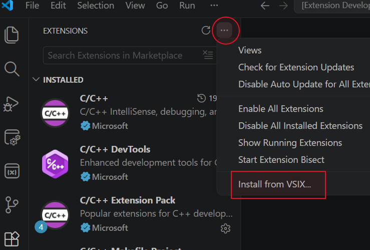
## Setting Up a Workspace

In Visual Studio Code, a workspace is a folder that contains your projects and shared settings. In VS Code terminology, “projects” are typically represented as subfolders within the workspace. For the HPE Nonstop IDE Software for VS Code, use a workspace to organize Nonstop projects, enabling shared configurations like connections and toolchains.

Steps to Set Up Your Workspace

- Open VS Code: Launch Visual Studio Code with the extension installed.

- Open or Create a Folder:

- Go to File \> Open Folder....

- Select an existing folder (e.g., for imported projects) or create a new one (e.g., NonstopWorkspace).

- This folder becomes your workspace root.

- Verify:

  - Check the Explorer sidebar for the folder.

  - The status bar shows the workspace name.

  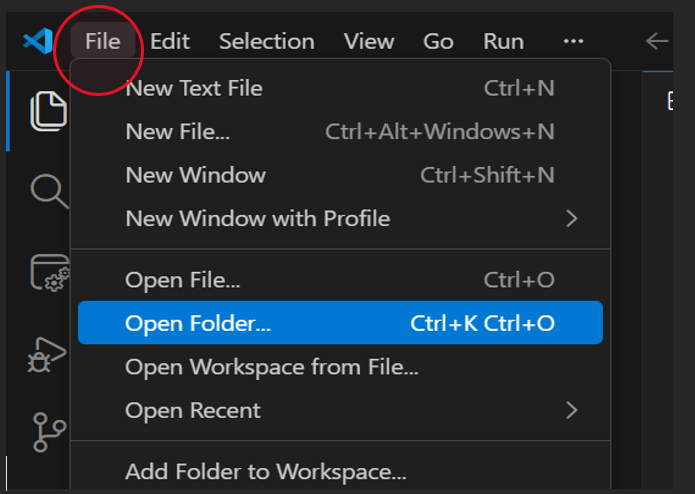
  
  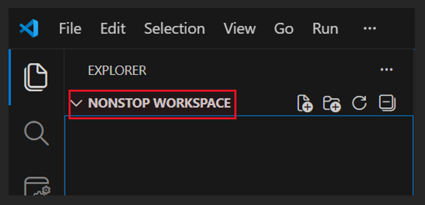
Workspace Structure

- Organize your workspace as follows:

- Root Folder: e.g., NonstopWorkspace.

- Project Subfolders: e.g., MyProject/ containing source files (.c, .cpp) and optional Makefile.

Example:

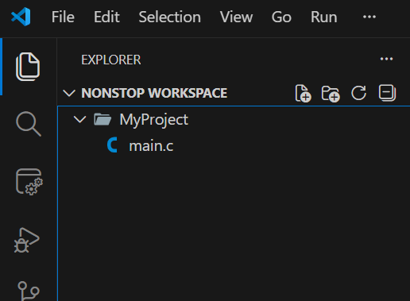

## Setting Up Logging

In VS Code, open **Settings** using Ctrl +, or navigate to **File -> Preferences -> Settings**, then search for **HPE Nonstop**.

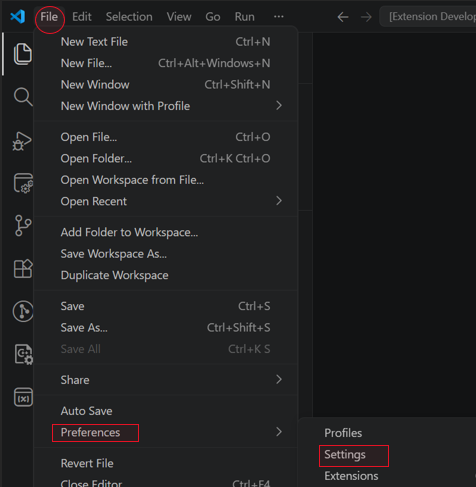

Under **HPE Nonstop -> Logging: Level**, select the desired verbosity level for the HPE Nonstop output channel.

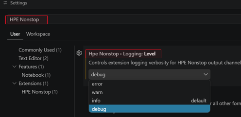
The available levels are:

- **error** – Displays only error messages

- **warn** – Displays warnings and errors

- **info** – Displays standard operational messages (default)

- **debug** – Displays the most detailed diagnostic output

To view the logs:

Go to **View -> Output**

From the dropdown in the Output panel, select **HPE Nonstop**
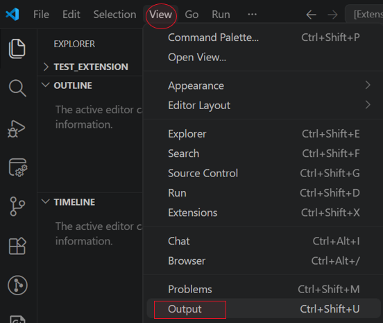
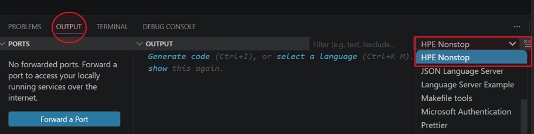

## Setting Up SSH Connection Health Check 

In VS Code, open **Settings** using Ctrl +, or navigate to **File -> Preferences > Settings**, then search for **HPE Nonstop**.

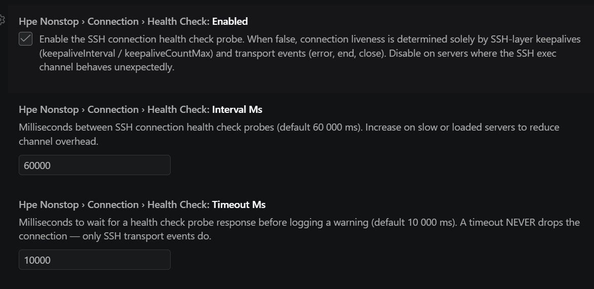

## Why we use this
- Keeps remote SSH sessions stable during development.
- Verifies that the connection is still alive at regular intervals.
- Reduces false disconnect behavior in long-running workflows.
- Adds reliability without forcing a disconnect on probe timeout.

## Where it helps
- Remote build, deploy, debug, and file transfer sessions.
- Slow or heavily loaded servers.
- Networks with intermittent latency.
- Long VS Code sessions connected to Nonstop systems.

## Key behavior
- Health check uses a lightweight SSH exec probe.
- Probe timeout logs a warning only.
- Actual disconnect state is decided by SSH transport events (error, end, close).

## Settings (HPE Nonstop)
- `connection.healthCheck.enabled`: Enables or disables the SSH connection health check probe. When disabled, connection liveness is determined by SSH keepalives and transport events (error, end, close).
- connection.healthCheck.intervalMs:  Time between health check probes in milliseconds. Default value: 60000 ms (60 seconds). Increase this value on slow or heavily loaded servers to reduce channel overhead.
- connection.healthCheck.timeoutMs: Time to wait for a health check probe response before logging a warning. Default value: 10000 ms (10 seconds). A timeout does not disconnect the session; only SSH transport events can trigger a disconnect.

## Important note
- If connection.healthCheck.enabled is set to false, connection liveness is determined solely by SSH keepalives and transport events (error, end, close).
- Health check probe timeouts generate warning messages only and do not terminate the SSH connection.
- Increase connection.healthCheck.intervalMs on busy or heavily loaded servers to reduce health check overhead.

Next Steps

With your workspace ready, proceed to [Creating Projects](#creating-projects) to add and configure projects inside your workspace.


---

# Nonstop Tools

## Configuring connections

The Configuring connections to Nonstop systems option is used to open the Network Connections preference page. This Network Connections preference page allows you to define the connection to Nonstop systems when launching applications, transferring files, or deploying built executables or libraries. Connections are stored securely and can be reused across projects.

**Accessing the Configure Connections Page**

- From the status bar at the bottom of VS Code, click the Configure Connections button.

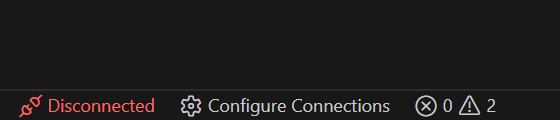
- Alternatively, in the left sidebar, click the Nonstop Tools button, then click Configure Connections under the Connections section.
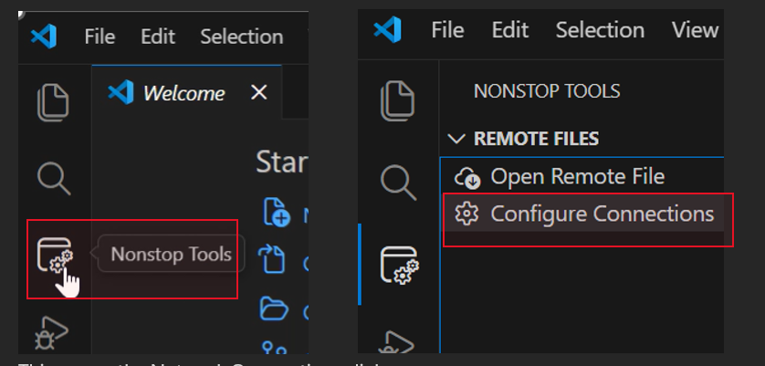
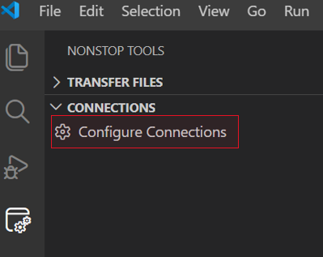
- This opens the Network Connections page.

- You can also use the Command Palette: press Ctrl+Shift+P, type HPE Nonstop, and then select HPE Nonstop: Configure Connections.

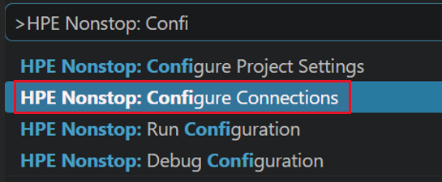
**Creating a New Connection**

- In the Connections dialog, click New....

- A new tab opens for entering connection details.
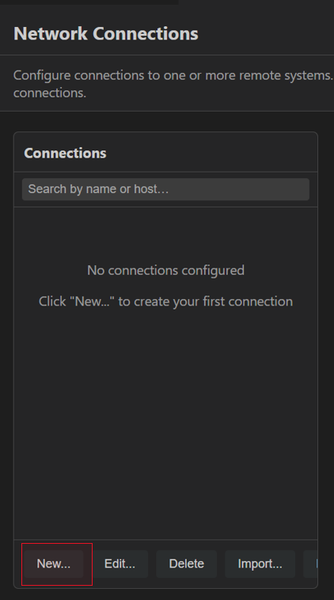
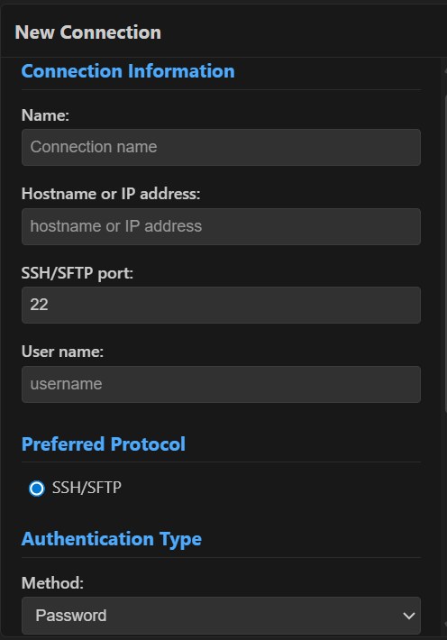

Fill in the following fields:

| **Field** | **Description** |
|----|----|
| **Name** | Enter a name for this connection (e.g., "MyNonstopServer"). |
| **Hostname or IP address** | Enter the hostname or IP address of the Nonstop system. |
| **SSH/SFTP port** | Port number SSH and SFTP connects to on the Nonstop server. The default SSH port is 22. |
| **Username** | Username or alias to use when connecting to a specified system. |
| **Preferred Protocol** | Select **SSH/SFTP**. |
| **Authentication Type \> Method** | Select **Password** or **Key Based Authentication.** |
| **Password** *(Password-based only)* | Enter your password. |
| **Private Key Path** *(Key-based only)* | Path to a private key file that you generated via a program such as ssh-keygen. See [ssh-keygen](#tips-on-setting-up-password-free-logins-with-open-ssh). |
| **Use root CA certificate** *(Key-based only)* | Click to change the location of the root CA certificate for the Invoke broker. It is required only for SQL/MX preprocessor builds. |
| **Root CA Certificate Path** *(Key-based only)* | Browse and select the certificate file. \*For SQL/MX Preprocessor build. |
| **Check for known hosts** | Click to have SSH save validated hosts to a file. (If you cleared this setting, you are prompted on every login to verify that the login system is trusted.) |
| **Known hosts file location** | Path to a file where trusted hosts can be stored. |

Click **Save**.

**For Password based**: A dialog appears asking if you want to save the password for future reference or just connect once. If you choose to save, the password is stored securely in VS Code's secret storage. If you choose not to save, you'll be prompted for the password each time you connect.

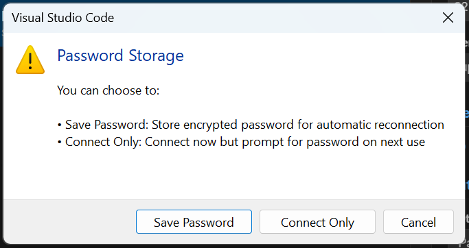
**For Key-Based authentication**: No password prompt will appear because key‑based authentication is being used

**Managing Connections:**

- **Connecting**: In the left Connections tab, select a connection and click **Connect** at the bottom. The extension establishes the connection.

- When connected, the connection's tab color turns green, and a status indicator at the bottom shows the machine name in green.
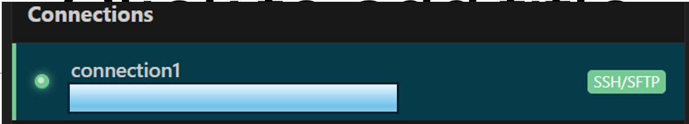
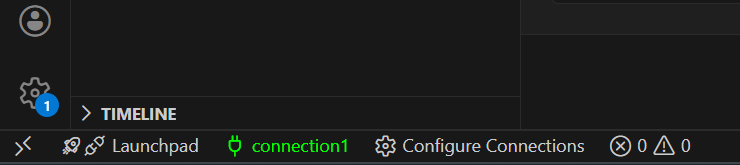
- **Adding More Connections**: Click **New...** again to add additional connections.

- **Editing Connections**: Select a connection name, then click **Edit...** to modify its details.

- **Deleting Connections**: Select a connection name, then click **Delete** to remove it.

- **Importing Connections**: Click Import to load connection configurations from an external file (such as an XML export).

- **Exporting Connections**: Click Export to save all current connection configurations to an external file for backup or transfer.

  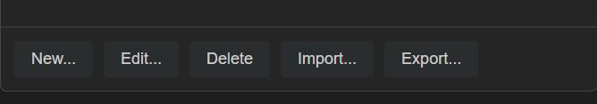
- **Disconnecting:** Select a connection and click Disconnect at the bottom.

Connections are saved globally and can be reused across projects. Active connections are indicated with a green dot. If a connection fails, the extension provides options to retry or configure settings.

In the Run and Debug configuration pages, connections in the dropdown are visually grouped, with connected ones shown first, followed by disconnected ones. Currently, if a user connects to a new connection or disconnects an existing one, the updated sorting is not reflected automatically. To see the changes, the user needs to reopen the pages.

## Transfer Files Wizards

Nonstop Tools menu provides following transfer files wizards:

- Transfer Files to Nonstop

- Transfer files from Nonstop


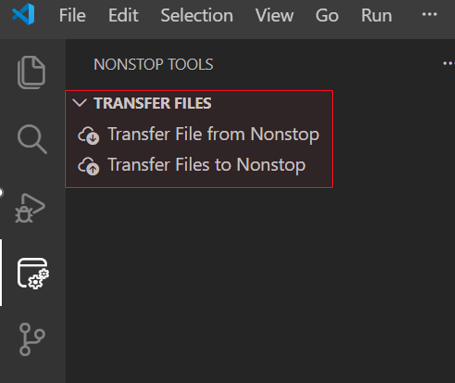
### Transfer Files to Nonstop

The Transfer Files to Nonstop wizard transfers one or more files to a location on a Nonstop system. You can use this Transfer Files wizard to transfer a single file, multiple files, entire folders (including subfolders), or all files contained in a project, including executable and object files.

**Transferring Files Process**

- **Right-click Method**:

  - Right-click on the project folder in the VS Code Explorer.

  - Select **HPE Nonstop: Transfer Files to Nonstop  (pre-selects that project)**.

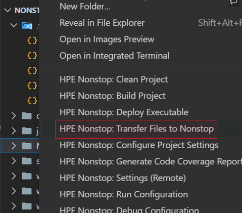
- **Command Palette Method:**

  - Open the Command Palette (Ctrl+Shift+P).

  - Type "HPE Nonstop" and select HPE Nonstop: Transfer Files to Nonstop.

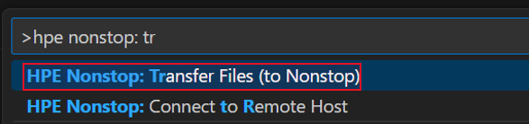
- Page 1: File Selection & Configuration

  - File Selection (Split Panels)

  - Left Panel - Directory Tree:

    - Shows project folder structure with expandable directories

    - Checkboxes (✓): Select directories to include all files recursively

    - Buttons: Filter Types, Select All, Deselect All

  - Right Panel - File List:

    - Displays files in the selected directory

    - Shows file name, size, and checkboxes for individual selection

  - Destination settings

| Setting | Description |
|----|----|
| System | Dropdown to select pre-configured Nonstop connection; Edit button to manage connections |
| Platform | OSS or Guardian |
| Location | Remote path; validates format based on platform; Browse button to select interactively |

- Transfer Options

  - **Skip transfer if file exists in destination**— Don't overwrite existing files

  - **Transfer only if modified since previous transfer**— Only upload changed files since last transfer

  - **Copy all files to destination without creating subdirectories**— Copy all files to destination without preserving structure (auto-enabled for Guardian)

- Navigation

  - **Next** — Proceeds to Page 2 (requires: files selected, connection selected, valid remote path)

  - **Cancel** — Closes dialog

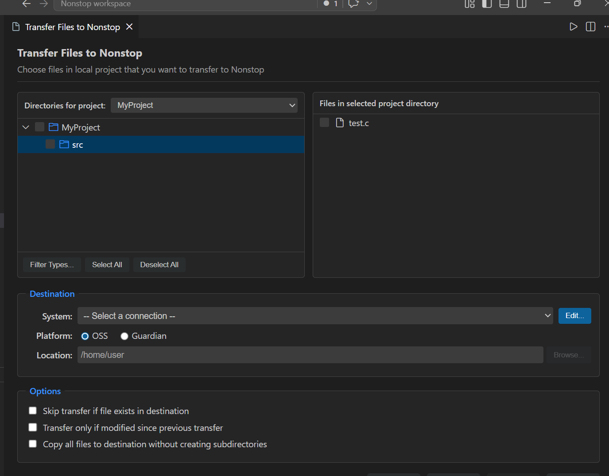
- Page 2: File Review & Renaming

  - Table displays:

    - Local file - Source file path

    - Remote directory - Destination folder

    - Remote name - Editable filename as it will appear on remote system (pre-filled)

Optional: Edit remote filenames before upload.

Click Finish to start transfer.

- Navigation

  - \< Back - Returns to Page 1

  - Finish - Executes upload (shows "Uploading..." during transfer)

  - Cancel - Closes dialog

- Upload Execution

Once Finish is clicked:

- Establishes connection (if inactive)

- Validates remote path accessibility

- Transfers files per your selections, options, and renamed filenames

- Terminal logs all transfer activity

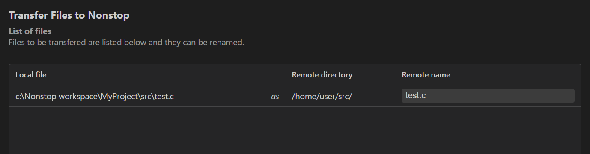
Monitor the terminal output for transfer results. If errors occur, review the Remote Settings and connection configuration. Successful transfers allow you to run or use the files on the Nonstop system.

### Transfer Files (from Nonstop)

The Transfer Files (from Nonstop) wizard supports transfer files from Nonstop to the local system

- This opens the Transfer Files page in a new tab.

Remote Location Section

| Field | Description |
| --- | --- |
| System | Select an existing connection from the dropdown. If no connections are available, clickEdit...to configure them. |
| Platform | Choose the system type:OSSorGuardian. This determines path formatting and available locations. |
| Location | Enter the remote directory path manually or clickBrowse...to navigate the remote filesystem interactively.ForOSS: Use absolute paths starting with / (e.g., /home/username).ForGuardian: Use paths starting with $ (e.g., $VOLUME.SUBVOL).The browser will load and display files in the selected directory. |
| Download to | Specify the local directory where downloaded files will be saved. ClickBrowse...to select a folder on your machine. By default, files are saved in workspace/remote-files (the folder is created automatically if it does not already exist). |
| Auto Sync | Toggle to enable automatic synchronization. When enabled, local edits are automatically uploaded back to the remote file. Useful for keeping local and remote copies in sync during development. |

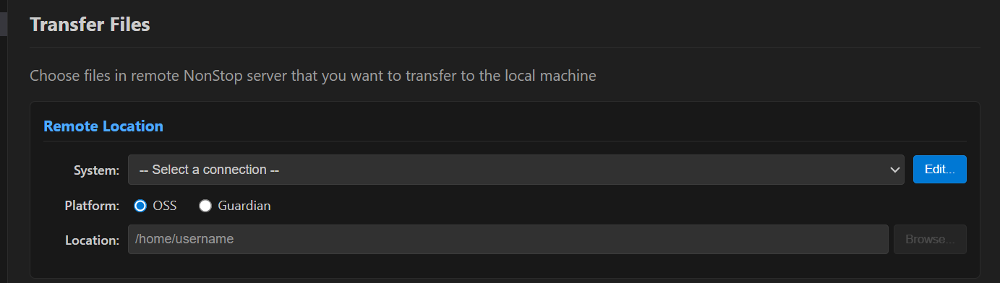
Files Browser Section

- After setting the remote location, the Files in selected remote directory section displays the contents.

- Navigate directories by clicking on folder names (e.g., ... to go up).

- Select files by checking the corresponding checkboxes next to each file.

- Use Select All to quickly select all files in the current folder.

- Use Deselect All to clear all selected files.

- Use Refresh to reload the directory folder.

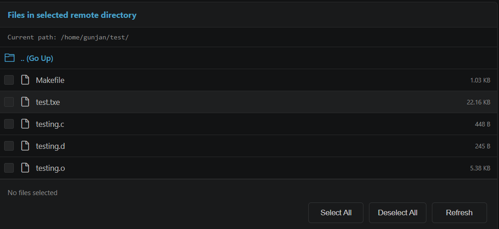
Local Location Section

- Downloading Files

- Select the desired files in the remote browser.

- Enter or browse the local download directory.

Auto Sync Section

- In the **Auto Sync Section**, toggle the **Auto Sync** checkbox to **ON**

- Local Edits Detected: When you modify any downloaded file in your local editor, the system detects the change

- Automatic Upload: The edited file is automatically uploaded back to the remote system at the configured location

Action buttons

- Click Download Selected.

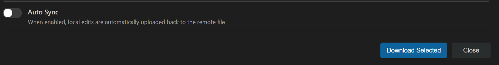
- The files will be downloaded to your local machine. A progress indicator shows the download status.


---

# Creating Projects

This section explains how to create projects in your workspace. Projects organize your Nonstop applications for building, deploying, and debugging. Unlike NSDEE, which provides fully functional Makefiles, this extension generates starter Makefile templates that you must review and edit to meet your build requirements.

## Creating a Project from Scratch

To create a new project from scratch:

- Create a new project (subfolder) in your workspace (e.g., MyProject).

- Add your C/C++ source files (.c, .cpp) to this folder.

After creating the project and files, configure the project using the pages below.

### Opening the Configure Project Settings Page

To open the Configure Project Settings page:

- Right-click on the project in the VS Code Explorer and select **HPE Nonstop: Configure Project Settings**.

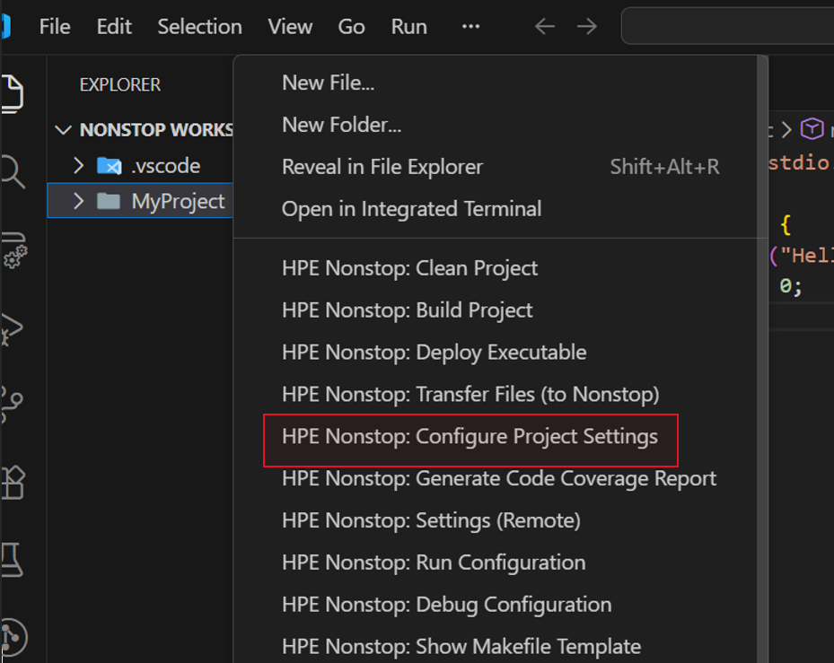
- Alternatively, use the Command Palette (Ctrl+Shift+P), type "HPE Nonstop", and select **HPE Nonstop: Configure Project Settings**. Then, select the project from the list.

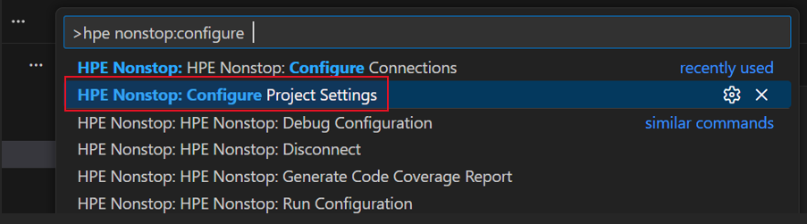

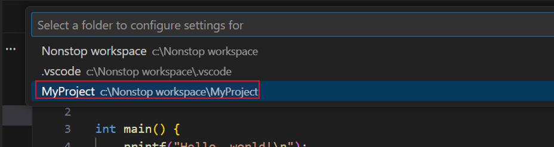
### Initial Build Settings Page

The **Configure Project Settings** page is the central place to configure build settings for your project. For a simple C/C++ project from scratch, select the following options:

| Setting | Description |
| --- | --- |
| Generate Makefile Template | When checked, the extension will automatically create or update a Makefile template in your project's root directory based on the settings you provide on this page. |
| SQL Tools | SelectNonefor standard C/C++ projects. |
| Set non-standard location for compiler | Check this box if your HPE Nonstop compilers are installed in a directory other than the default. |
| Compiler Version | Select the version of the HPE Nonstop cross‑compiler you want to use for this project |
| Compiler Executable | Select thec89,c99, c11, or nsccoption depending on whether you want to build your project with the c89, c99, c11, or nscc compiler on TNS/X. Any of the compilers can be used to build the project, as long as it is part of the cross-compiler selected |
| C/C++ Standards | When you select an L25.x toolset together with the nscc.exe compiler executable, the “C/C++ Standard” option is enabled so you can choose the desired language standard.NoteFor C projects, only C language standards are enabled.For C++ projects, only C++ language standards are enabled. |
| COMP_ROOT | This is a read-only field that displays the automatically calculated root path of the selected compiler. |
| Build Mode | Debug: Compiles your project with debugging flag (-g ). This is recommended for development and debugging.Release: Compiles your project with optimizations for production |
| Compiler Flags | Specify any additional flags to be passed to the compiler. |
| System Type | Choose theOSSorGuardianbutton, depending on which platform you want your project to build for. Your choice is used to set the TARGET_SYSTYPE macro, which is passed to tool options that take OSS and Guardian options. |
| Enable Code Coverage | If checked, this adds the necessary -Wcodecov flag to the compiler options to generate code coverage information during the build.When enabled, two additional options appear:Profmrg options: Specify options for the profmrg tool, such as -dump to dump profiling data.Code coverage options: Specify additional code coverage options, such as -counts to collect execution counts. |

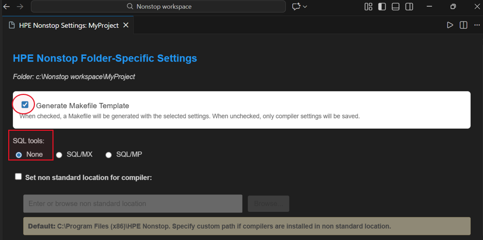

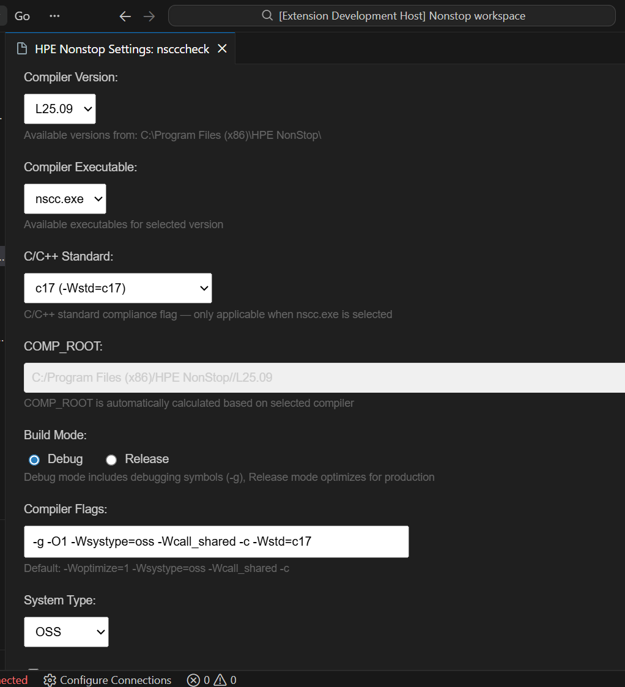
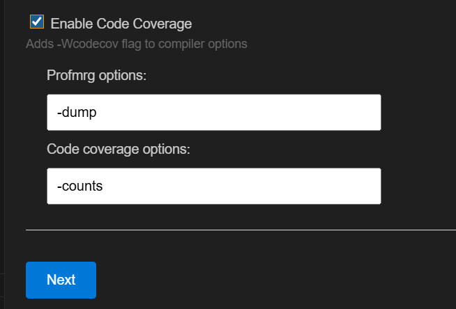

**Navigation**

After filling in all the details, click **Next** to proceed to the Remote Settings page.

### Remote Settings Page

The **Remote Settings** page allows you to configure how your project connects to and interacts with a remote Nonstop system. This page appears after you complete the Project Settings page.

**Fields and Options**

- **Connection Settings**

  - Select Connection:  
    Choose an existing SSH/SFTP connection from the dropdown.  
    Click Manage Connections to add, edit, or remove connections.  
    For more details, see the [Connections Configuration](#configuring-connections) page.

- **System Type**

  - Select the target system type:  
    Choose between OSS and Guardian to match your deployment environment.

- **Remote Path**

  - Enter the remote path for this folder:

  - Remote directory or subvolume where locally built object is transferred on the selected Nonstop system  
    *Example: /home/username*

- **Target file name (-r):**

  - Optional. File name that is given to the remote copy of the transferred file.

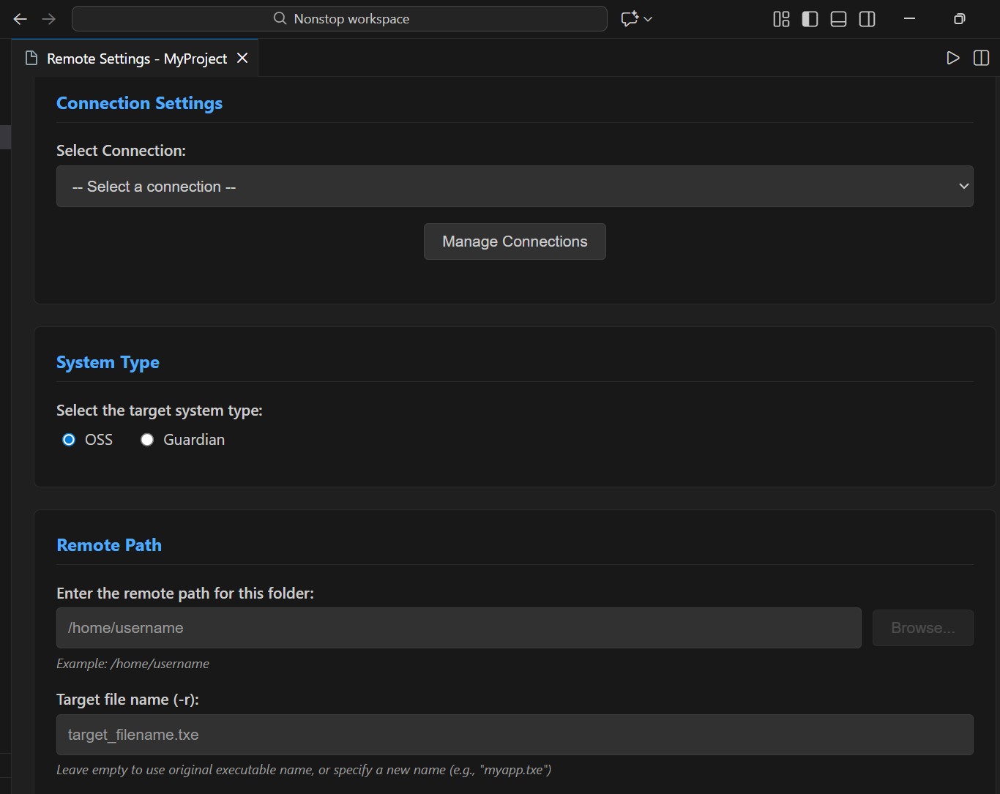
- **Action Buttons**

  - **Complete Setup & Generate/Update Makefile:**  
    This button saves your settings and generates or updates the Makefile template for your project.

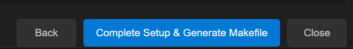

*After saving your remote settings, your project is ready for building, deploying, and running on the Nonstop system!*

> **Note:** To update any project configuration - whether it involves modifying settings in the [Configure Project Settings page](#opening-the-configure-project-settings-page), updating options in the [Remote Settings page](#remote-settings-page), or adding new source files (such as .c, .cpp, or header files) follow the same workflow:

- Open the Configure Project Settings page and make the required changes.

- Proceed to the Remote Settings page.

- Click Complete Setup & Generate/Update Makefile to apply the updates.

## Creating a Project from Existing Sources

You can create a project from existing sources using one of the following methods:

**Method 1: Copy an Existing Project**

- Copy an existing project (for example, from NSDEE or another source) into your workspace directory.

- Ensure the project includes all required source files (\*.c, \*.cpp, header files, etc.) and an existing Makefile.

  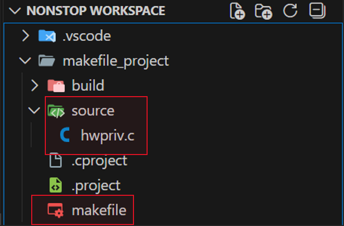
### Method 2: Open an Existing Workspace (e.g., from NSDEE)
- Open an existing workspace (e.g., workspace) that already contains the projects.

- Make sure the workspace is properly configured with all project files and build settings.

  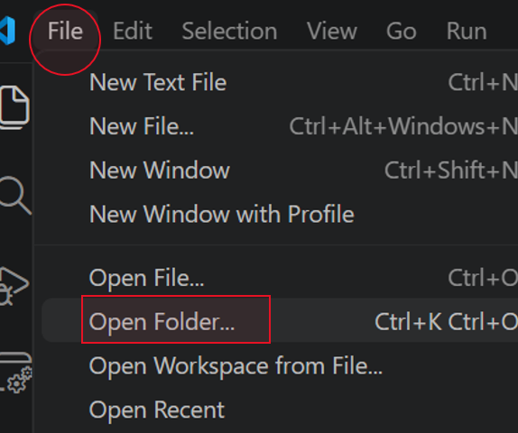
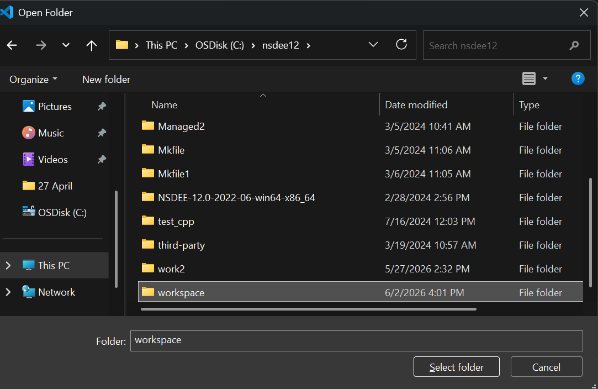
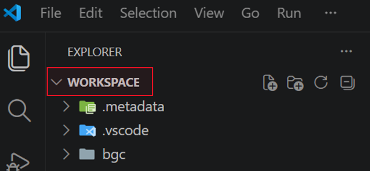
### Method 3: Open the Parent Folder of the Project
If you want to work directly on an existing project without copying it into a separate workspace:

- Open the parent folder containing the project in VS Code (instead of opening the project folder directly).

- This ensures the workspace is set up correctly and all project configurations function as expected.

- Example: If you want to work on the cmptest_gua_tnsx project, open its parent folder (Test_Extension) in VS Code instead of opening the project folder directly.

  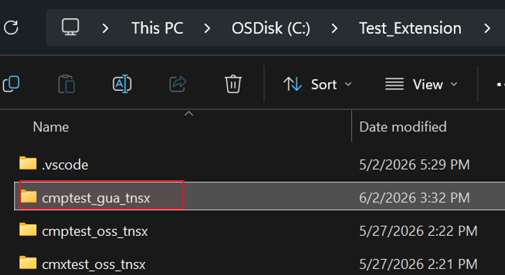

  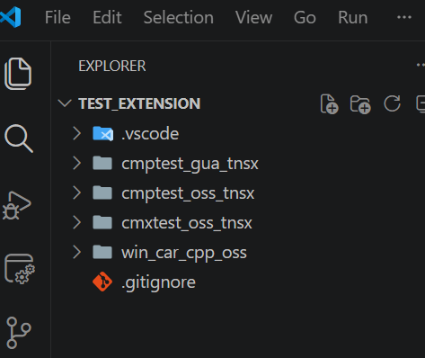
***Important:***

*Do not open the project folder directly in VS Code. Always open its parent directory to ensure proper workspace behavior.*

*A valid workspace is required for the project to work correctly.*

After copying the project, configure the project using the pages below.

### Opening the Configure Project Settings Page

See Opening the [Configure Project Settings Page](#opening-the-configure-project-settings-page) above.

### Initial Build Settings Page

For a project from existing sources, the settings are similar to creating a project from scratch, with specific exceptions to prevent overwriting your existing Makefile.

Refer to the [Initial Build Settings Table](#initial-build-settings-page) above for field definitions.

Differences for Existing Sources:

| Setting | Description |
| --- | --- |
| Generate Makefile Template | Uncheck this box.The extension willnotgenerate a Makefile template; it will use the existing one found in your project. |
| Enabled Fields | Since Makefile generation is disabled, most build options are hidden or disabled. Only the following remain editable:SQL Tools(SelectNone)Set non-standard location for compilerCompiler Version(and standard location settings)Enable Code Coverage(and associated options) |

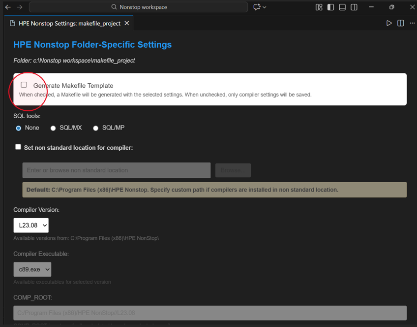
**Navigation**

After filling in all the details, click Next to proceed to the Remote Settings page.

### Remote Settings Page

See [Remote Settings Page](#remote-settings-page) in the "Creating a Project from Scratch" section for the fields and options.

The only difference is the action button:

- **Action Buttons**

  - Save Settings: This button will save your configuration settings without generating or updating the Makefile.

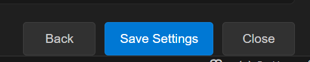
After saving your remote settings, your project is ready for building, deploying, and running on the Nonstop system!

> **Note:** To update any project configuration—such as changing the compiler version, modifying settings in the Configure Project Settings or Remote Settings pages, updating the Makefile, or adding new source files (e.g., .c, .cpp, or header files) follow the same workflow:

- Open the Configure Project Settings page and make the required changes.

- Proceed to the Remote Settings page.

- Click Save Settings to apply the changes.

When working with an existing project that includes a Makefile, the extension provides limited automatic updates for certain flags. Specifically:

- Supported Flags: The extension automatically updates the -I (include) flag if the specified location is not found. Once the user clicks Save Settings, the extension attempts to resolve and update the location automatically.

- Unsupported Flags: Other valid flags (e.g., -D, -L, -l, or any other compiler/linker flags) are not yet supported for automatic updates. Users must manually verify and update these flags in the Makefile to ensure proper configuration.

This behavior ensures that the extension does not overwrite or misinterpret configurations in your Makefile. Users should review and adjust their Makefile settings as needed before proceeding.

## Creating a SQL/MX Project from Scratch

To create a new SQL/MX project from scratch:

- Create a new subfolder in your workspace (e.g., MySQLMXProject).

- Add your SQL/MX embedded files (.ec, .ecpp) to this folder.
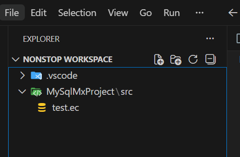
After creating the folder and files, configure the project using the pages below.

### Opening the Configure Project Settings Page

See Opening the [Configure Project Settings Page](#opening-the-configure-project-settings-page) above.

### Initial Build Settings Page

The Configure Project Settings page is the central place to configure build settings for your project. For a SQL/MX project from scratch, select the following options:

When you select SQL/MX as the SQL tool, the extension provides additional tools for SQL/MX processing, including a C/C++ SQL/MX Compile tool and a C/C++ SQL/MX Preprocessor tool. These tools are mandatory for projects that use SQL/MX.

| Setting | Description |
| --- | --- |
| Generate Makefile Template | Check this box.The extension will automatically create or update a Makefile template in your project's root directory based on the settings provided. |
| SQL Tools | SelectSQL/MXfor SQL/MX projects. |
| Importing Existing Eclipse Project | Uncheck this boxfor new projects.(This setting is used to update authentication in existing Eclipse Makefiles). |
| SQL/MX Preprocessor Configuration | This option is enabled only whenSQL/MXis selected.Use theConfigure Locationbutton to specify the location of C/C++ preprocessors. The extension uses these locations to set the environment variable for MXSQLC (for C/C++) for processing embedded SQL statements. |
| Compiler Location, Version, Build Mode and Code coverage | Select the cross‑compiler location version (when nscc.exe is selected for an L25.x toolset choose the desired C/C++ language standard). Next, choose the build mode (Debug or Release), specify any additional compiler flags, and configure code coverage options as needed. For detailed explanations of each setting, see the "Creating a Project from Scratch" section. |

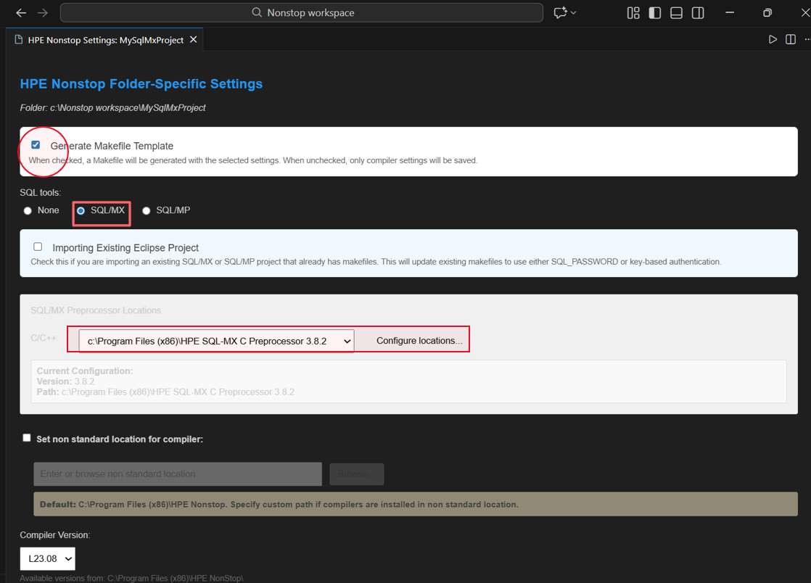
**Navigation**

After filling in all the details, click Next to proceed to the SQL/MX Remote Settings page.

### SQL/MX Remote Settings Page

The SQL/MX Remote Settings page allows you to configure compilation, deployment, and preprocessor settings for SQL/MX projects.

Fields and Options:

| Settings | Description |
|----|----|
| Target system/user (-Wsql{host/user}=): | Nonstop system and user ID to be passed to the compiler for SQL compilation. The system/user name pair in the combo box is split up so that system and user can be passed separately to the –Wsqlhost and -Wsqluser options, respectively. |
| OSS compilation directory (-Wsqlloc=): | Remote directory where SQL compilation takes place (passed to –Wsqlloc= option). |
| Use same system as for SQL/MX compilation: | Select this if the same system and user set for SQL/MX compilation can also be used for Deploy and SQL/MX preprocessing. |
| Target system/user (-h/-u): | The system and user name to be passed to the Deploy tool for the deploy process. |
| Target destination (-dir): | Optional. Remote directory or subvolume where locally built object is transferred on the selected Nonstop system. |
| Target file name (-r): | Optional. File name that is given to the remote copy of the transferred file. |
| System (-Wsql{host/user}=): | Nonstop system and user ID to be passed to the compiler for SQL preprocessing. The system/user name pair in the combo box is split up so that system and user can be passed separately to the –Wsqlhost and -Wsqluser options, respectively. |
| *ODBC port/Invoke broker (-Wsqlmx_port=)*\*: | Nonstop system port to connect to as the ODBC port or Invoke broker (passed as argument to –Wsqlmx_port=). |
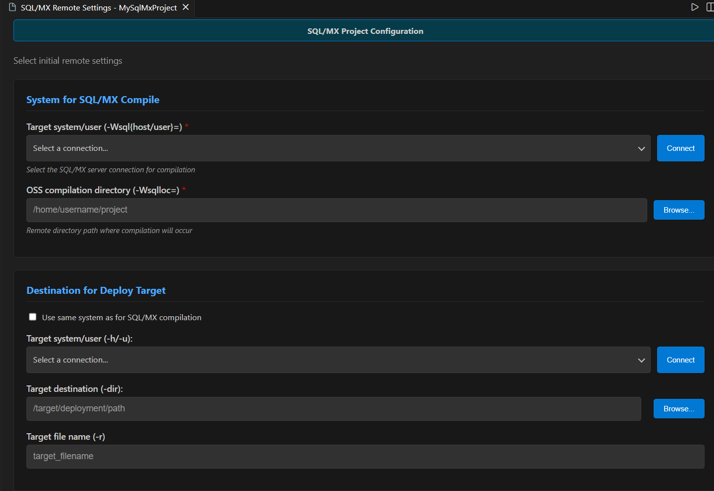
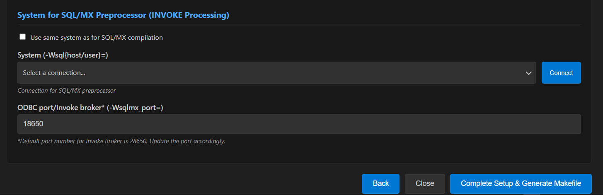
> **Note:** All SQL builds also support password-less connection.

**Action Buttons**

Complete Setup & Generate/Update Makefile:  
This button will save your settings and generate or update the Makefile template for your project.

*After saving your remote settings, your project is ready for building, deploying, and running on the Nonstop system!*

> **Note:** To update any settings whether it involves modifying settings in the [Configure Project Settings page](#initial-build-settings-page-2), updating options in the [Remote settings page](#sqlmx-remote-settings-page), or adding new source files (such as .ec, .ecpp, or header files) repeat the same steps—open the Configure Project Settings page, make your changes, and then click **Complete Setup & Generate/Update Makefile** on the SQL/MX Remote Settings page.

## Creating a SQL/MX Project from Existing Sources

To create a SQL/MX project from existing sources:

**Method 1: Copy an existing project.**

- Copy an existing project folder (e.g., from NSDEE or another source) into your workspace.

- Ensure the folder contains source files (.ec, .ecpp) and an existing Makefile.
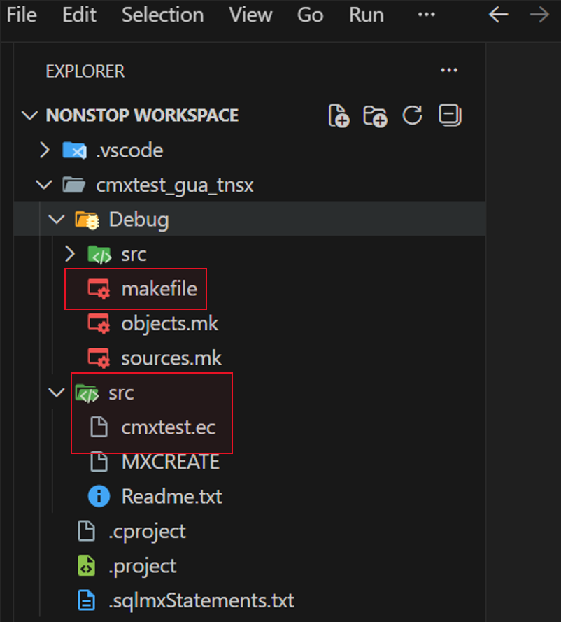
**Alternative Methods**

Other approaches for creating a project from existing sources are described in detail in a separate section. You can refer to that documentation for step-by-step instructions:

- [Open an Existing Workspace.](#method-2-open-an-existing-workspace-eg-from-nsdee)

- [Open the Parent Folder.](#method-3-open-the-parent-folder-of-the-project)

> **Note:** For SQL/MX existing projects, ensure the Makefile includes the -wsqlloc flag in the C/C++ SQL/MX compile rule. The -wsqlloc flag is mandatory.

After copying the project, configure the project using the pages below.

### Opening the Configure Project Settings Page

See Opening the [Configure Project Settings Page](#opening-the-configure-project-settings-page) above.

### Initial Build Settings Page

Differences for Existing Sources:

| Setting | Action/Behavior |
| --- | --- |
| Generate Makefile Template | Uncheck this box.The extension will not generate a Makefile template; it will use the existing one found in your project. |
| SQL Tools | Select SQL/MX for SQL/MX projects. |
| Importing Existing Eclipse Project | Check this box.This tells the extension you are importing an existing project (e.g., from Eclipse/NSDEE). It triggers logic to update authentication methods in your Makefiles. |
| Authentication Update | When Importing Existing Eclipse Project is checked, saving settings triggers an automatic update to secure authentication:1. Prompt: You will see a dialog: "This will update existing makefiles to replace Eclipse authentication with SQL_PASSWORD. Continue?"2. Action: If confirmed, the extension replaces Eclipse-specific auth patterns with compliant flags:• Password: -Wsqluser=USER,$$SQL_PASSWORD• SSH Key: -wsshkey=path/to/private.keyNote: This ensures compatibility with the extension's connection management. |
| Enabled Fields | Since Makefile generation is disabled, only the following fields remain editable:• Compiler Version (and standard location settings)• SQL/MX Preprocessor Configuration• Enable Code Coverage |

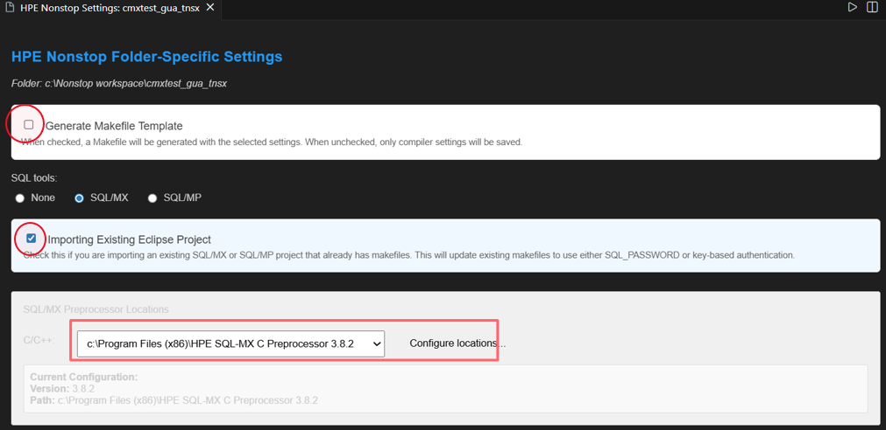
**Navigation**

After filling in all the details, click Next to proceed to the SQL/MX Remote Settings page.

### SQL/MX Remote Settings Page

See [SQL/MX Remote Settings Page](#sqlmx-remote-settings-page) in the "Creating a SQL/MX Project from Scratch" section for the fields and options.

The only difference is the action button. When it is an imported project, it prompts the user that it will update your existing Makefile based on the authentication:

**Action Buttons**

Complete Setup & Update makefile:  
This button will save your configuration settings without generating a Makefile and it will prompt to update the existing Makefile for secure authentication.

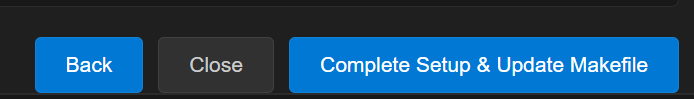

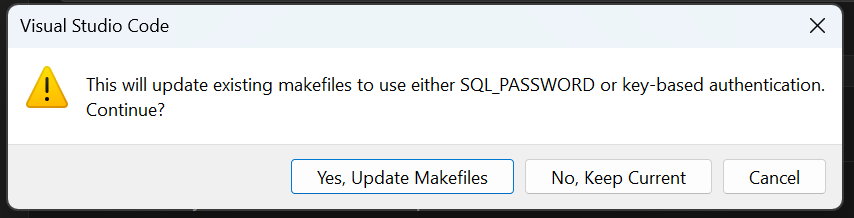
After saving your remote settings, your project is ready for building, deploying, and running on the Nonstop system!

> **Note:** If you want to update any settings, go through the same steps: Open the Configure Project Settings page, make your changes, and then in the SQL/MX Remote Settings page, click Complete Setup & Update Makefile.

- Open the Configure Project Settings page and make the required changes.

- Proceed to the Remote Settings page.

- Click Complete Setup & Generate/Update Makefile to apply the updates.

## Creating a SQL/MP Project from Scratch

To create a new SQL/MP project from scratch:

- Create a new project in your workspace (e.g., MySQLMPProject).

- Add your C/C++ source files (.c, .cpp) to this folder.

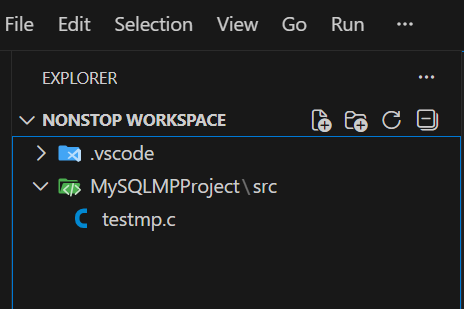
After creating the project and files, configure the project using the pages below.

### Opening the Configure Project Settings Page

To open the Configure Project Settings page:

See Opening the [Configure Project Settings Page](#opening-the-configure-project-settings-page) above.

### Initial Build Settings Page

The **Configure Project Settings page** is the central place to configure build settings for your project. For a SQL/MP project from scratch, fill in the details described below:

| Setting | Description |
| --- | --- |
| Generate Makefile Template | Check this box. The extension will automatically create or update a Makefile template in your project's root directory based on the settings provided. |
| SQL Tools | Select SQL/MP for SQL/MP projects. |
| Importing Existing Eclipse Project | Uncheck this box. |
| Compiler Location, Version, Build Mode and Code coverage | Select the cross‑compiler location version (when nscc.exe is selected for an L25.x toolset choose the desired C/C++ language standard). Next, choose the build mode (Debug or Release), specify any additional compiler flags, and configure code coverage options as needed. For detailed explanations of each setting, see the "Creating a Project from Scratch" section. |

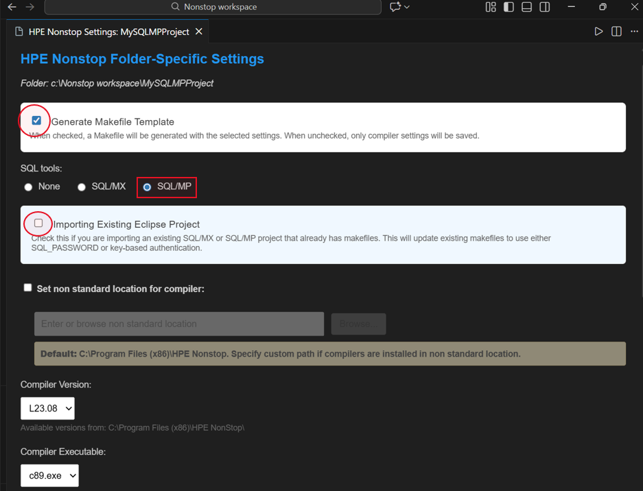
**Navigation**

After filling in all the details, click Next to proceed to the SQL/MP Remote Settings page.

> **Note:** To update any project configuration—such as changing the compiler version, modifying settings in the [Configure Project Settings](#initial-build-settings-page-3) or [Remote Settings pages](#sqlmx-remote-settings-page-1), updating the Makefile, or adding new source files (e.g., .c, .cpp, or header files) follow the same workflow:

### SQL/MP Remote Settings Page

The SQL/MP Remote Settings page allows you to configure compilation, deployment, and preprocessor settings for SQL/MP projects. This specialized settings page appears when you select SQL/MP as your SQL tool.

Fields and Options

| Settings | Description |
|----|----|
| **Target system/user (-Wsql{host/user}=):** | Nonstop system and user ID to be passed to the compiler for SQL compilation and preprocessing. The system/user name pair in the combo box is split up so that system and user can be passed separately to the –Wsqlhost and -Wsqluser options, respectively. |
| **Target file name (-Wsqlprog=):** | Specifies the file name given to the final build output when it is copied to a Nonstop system (passed as argument to –Wsqlprog=). |
| **Working subvolume (-Wsqlwork=):** | Optional. Specifies the working directory to use on the Nonstop system (passed as argument to –Wsqlwork=). |
| **Catalog location (-Wsqlcomp=catalog):** | Specifies subvolume catalog (passed as argument to –Wsqlcomp=catalog). |
| **Use same system as for SQL/MP compilation:** | Select this if the same system and user set for SQL/MP compilation can also be used for SQL/MP preprocessing. |

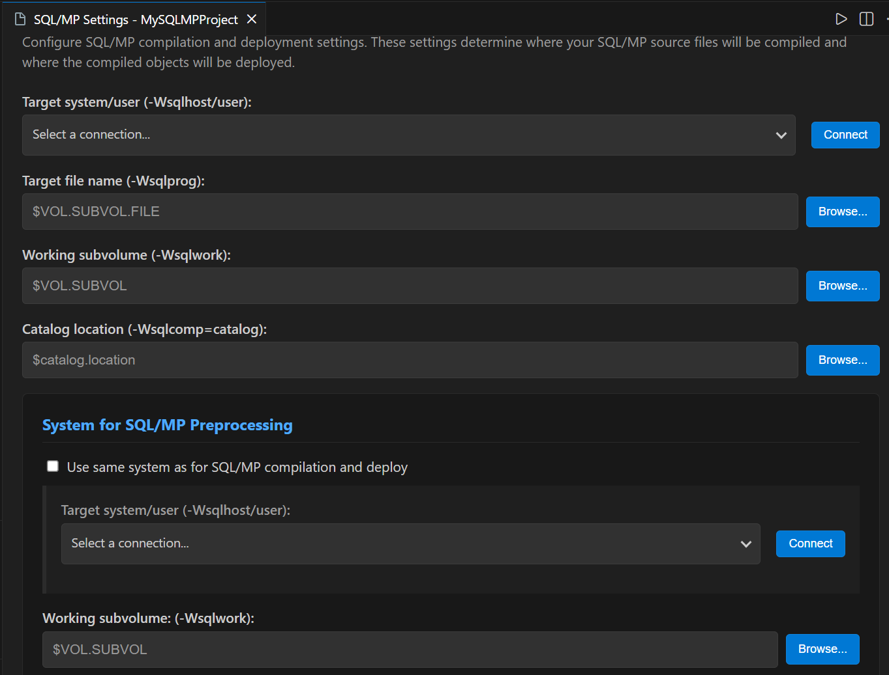
> **Note:** All SQL builds also support password-less connection.

**Action Buttons**

Complete Setup & Generate/Update Makefile:  
This button will save your settings and generate or update the Makefile template for your project.
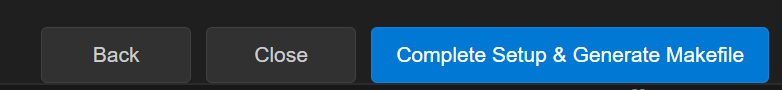
*After saving your remote settings, your project is ready for building, deploying, and running on the Nonstop system!*

> **Note:** To update any settings whether it involves modifying settings in the [Configure Project Settings page](#initial-build-settings-page-4), updating options in the [Remote settings page](#sqlmp-remote-settings-page), or adding new source files (such as .c, .cpp, or header files) repeat the same steps—open the Configure Project Settings page, make your changes, and then click **Complete Setup & Generate/Update Makefile** on the SQL/MP Remote Settings page.

## Creating a SQL/MP Project from Existing Sources

To create a SQL/MP project from existing sources:

**Method 1: Copy an existing project.**

- Copy an existing project folder (e.g., from NSDEE or another source) into your workspace.

- Ensure the folder contains source files (.c, .cpp) and an existing Makefile.
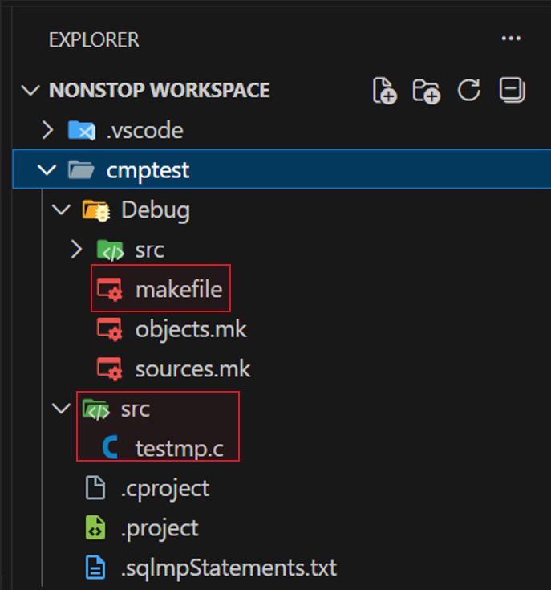
**Alternative Methods**

Other approaches for creating a project from existing sources are described in detail in a separate section. You can refer to that documentation for step-by-step instructions:

- [Open an Existing Workspace.](#method-2-open-an-existing-workspace-eg-from-nsdee)

[Open the Parent Folder.](#method-3-open-the-parent-folder-of-the-project)

After importing the folder, configure the project using the pages below.

### Opening the Configure Project Settings Page

To open the Configure Project Settings page:

See Opening the [Configure Project Settings Page](#opening-the-configure-project-settings-page) above.

### Initial Build Settings Page

The **Configure Project Settings** page is the central place to configure build settings for your project. For a SQL/MP project from existing sources, select the following options:

**Differences for Existing Sources:**

| Settings | Action/Behaviour |
| --- | --- |
| Generate Makefile Template | Uncheck this box.The extension willnotgenerate a Makefile; it will use the existing one found in your project folder. |
| SQL Tools | SelectSQL/MPfor SQL/MP projects. |
| Importing Existing Eclipse Project | Check this box.This tells the extension you are importing an existing project (e.g., from NSDEE). It triggers logic to update authentication methods in your Makefiles |
| Enabled Fields | Since Makefile generation is disabled, only the following fields remain editable:• Compiler Version (and standard location settings)• Enable Code Coverage (and associated options)• Importing Existing Eclipse Project (SeeImporting Existing Eclipse Projectfordetails on authentication updates). |

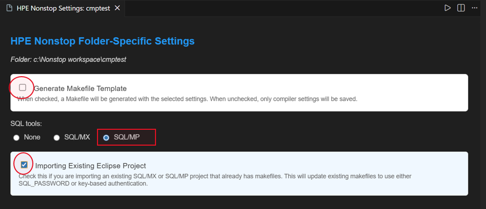
**Navigation**

After filling in all the details, click Next to proceed to the SQL/MP Remote Settings page.

### SQL/MP Remote Settings Page

See [SQL/MP Remote Settings Page](#sqlmp-remote-settings-page) in the "Creating a SQL/MP Project from Scratch" section for the fields and options.

The only difference is the action button. When it is an imported project, it prompts the user that it will update your existing Makefile based on the authentication modes:

**Action Buttons**

Complete Setup & Update Makefile:  
This button will save your configuration settings without generating a Makefile and it will prompt to update the existing Makefile for secure authentication.


*After saving your remote settings, your project is ready for building, deploying, and running on the Nonstop system!*

> **Note:** To update any project configuration—such as changing the compiler version, modifying settings in the [Configure Project Settings](#initial-build-settings-page-4) or [Remote Settings pages,](#sqlmp-remote-settings-page-1) updating the Makefile, or adding new source files (e.g., .c, .cpp, or header files) follow the same workflow:


---

# Editor Features: Nonstop Macros & Keywords

This section describes the editor features and support provided for Nonstop-specific macros and keywords in the **HPE Nonstop IDE Software for Visual Studio Code**.

## Overview

The extension provides comprehensive editor support for Nonstop-specific macros and keywords, enabling developers to work efficiently with Nonstop C/C++ code. All editor features are automatically configured and integrated with VS Code's IntelliSense and syntax highlighting systems.

## Nonstop Compiler Macros

### Automatic Configuration
The extension automatically configures Nonstop compiler macros for IntelliSense and code completion. These macros are essential for conditional compilation and platform-specific code and include:
- Target platform macros (`_OSS_TARGET`, `_GUARDIAN_TARGET`, `_TNS_X_TARGET`, `_TNS_E_TARGET`)
- Architecture macros (`_ILP32_MODEL`, `_LP64_MODEL`, `__ILP32`, `__LP64`)
- System information macros (`__TANDEM`, `_TANDEM_EXTENSIONS`, `_TANDEM_SOURCE`, `_TANDEM_ARCH_`)
- Compiler information macros (`__CPLUSPLUS_VERSION`, `__STDC__`, `_IEEE_FLOAT`, `_WIN32_HOST`)
- Floating point support macros (`_TNS_FLOAT`, `__XMEM`)

### Configuration File Location
All Nonstop macros are automatically added during extension initialization and on configuration save to:
```
.vscode/c_cpp_properties.json
```
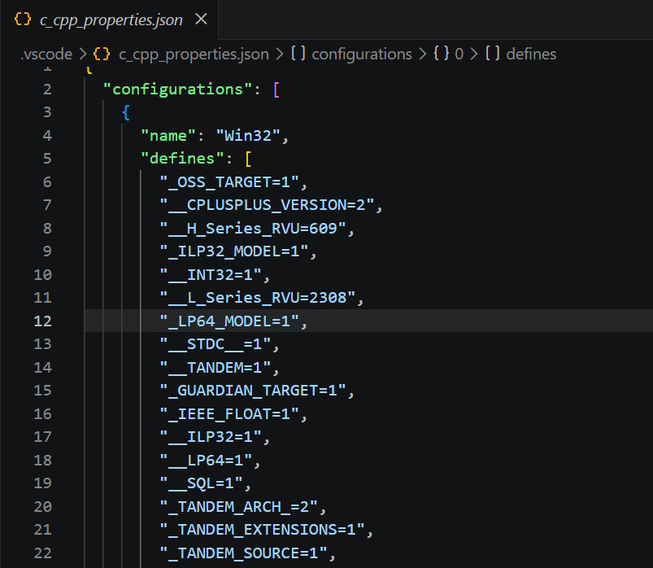
This file is located in the **root of your project directory**. The macros are stored in the `defines` array of your C/C++ configuration and are used by the IntelliSense engine for code completion and error checking.

### Important: Do Not Remove Macros
The Nonstop macros in `c_cpp_properties.json` should **not be manually removed or modified**. The extension automatically manages these macros to ensure proper IntelliSense support. If macros are accidentally removed:
1. The extension will re-add them on the next project initialization
2. Alternatively, you can manually restore them or reinitialize the project settings

## Nonstop Keywords and Language Extensions

The extension supports Nonstop-specific keywords including:
- Interop keywords (`export$`, `import$`) for Guardian and COBOL inter-program communication
- Type attributes (`_tal`, `_cobol`, `_c`, `_cc_status`, `_fortran`, `_pascal`, `_callable`, `_unspecified`)
- Memory qualifiers (`_lowmem`, `_lowmem64`, `_lowmem256`, `_resident`, `_extensible`, `_far`, `_near`)
- Addressing and memory keywords (`_baddr`, `_bitlength`, `_cspace`, `_waddr`, `_procaddr`, `_sg`, `_sgx`)
- Pragmas and annotations (`_alias`, `_arg_present`, `_atomic_put`, `_atomic_get`, `_interrupt`, `_kernel_callable`, `_optional`, `_priv`, `_variable`)
- Built-in functions (`__func__`, `__typeof`, `__va_start__`, `__va_list__`, `__BITADDR__`, `asm`)

## Core Editor Features

### Enhanced Highlighting: Nonstop Constructs and Keywords
- **Distinctive Styling**: Nonstop-specific keywords and extensions receive custom color highlighting with a distinctive appearance
- **Visual Distinction**: Nonstop extensions stand out visually in your code (light pink background), making it easy to identify platform-specific code at a glance
- **File Support**: Automatic highlighting for C/C++ files (`.c`, `.cpp`, `.h`, `.hpp`) and embedded SQL files (`.ec`, `.ecpp`)

### Go to Definition: Navigate Functions and Variables
Navigate through your codebase efficiently:
- **Cross-reference functions, variables, struct/union/enum definitions** across your workspace
- **Jump to macro definitions** and typedef declarations
- **Works across C, C++, and embedded SQL files**
- **Workspace-wide symbol search** across `.ec`, `.c`, and `.h` files

### Hover Information: Instant Documentation and Type Info
- **Quick Documentation**: Hover over any Nonstop keyword, macro, or function to see instant documentation
- **Type Information**: View parameter types, return types, and variable information at a glance

### Error Resolution for Nonstop Macros

- Certain Nonstop macros would cause errors in the editor
- These errors disrupted the development workflow
- IntelliSense would not recognize Nonstop-specific constructs
- Code validation would flag valid Nonstop code as errors

#### Improved Macro Handling in the Editor
- **Properly handles Nonstop macros** without displaying false errors
- **Recognizes Nonstop compiler macros** automatically
- **Validates Nonstop constructs correctly** with no false positives
- **Provides accurate IntelliSense** for all Nonstop-specific code
- **Eliminates macro-related errors** that previously disrupted development

The extension now properly integrates Nonstop macros into the C/C++ language server configuration, ensuring seamless development without errors.

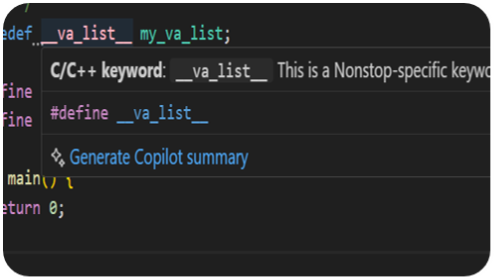

## Embedded SQL Support

For SQL/MX projects using embedded SQL (`.ec` and `.ecpp` files):
- **Document Symbols**: Parse and display function definitions in the Outline view
- **Go to Definition**: Cross-reference SQL and C code seamlessly
- **Language Mode**: Automatic detection and configuration for embedded SQL C files
- **Syntax Highlighting**: Proper highlighting for both SQL and C/C++ syntax

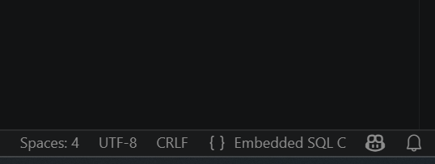

## Automatic Setup

The extension automatically:
1. Detects your project configuration
2. Adds Nonstop compiler macros to `.vscode/c_cpp_properties.json`
3. Enables syntax highlighting for Nonstop keywords with custom colors
4. Configures language modes for embedded SQL files
5. Sets up code navigation for workspace-wide symbol search
6. Validates Nonstop constructs without false errors

No manual configuration is required—start using these features immediately after installing the extension.

## Integration with Microsoft C/C++ Extension Pack

All editor features work seamlessly with the Microsoft C/C++ Extension Pack:
- IntelliSense with Nonstop macros and keywords
- Code completion with context-aware suggestions
- Syntax highlighting with proper color schemes
- Error checking with Nonstop-aware diagnostics
- Refactoring support with symbol renaming

## Troubleshooting

If you do not see Nonstop-specific syntax highlighting or IntelliSense:

1. Ensure the Microsoft C/C++ Extension Pack is installed and enabled
2. Check that your project's `.vscode/c_cpp_properties.json` file exists and contains the Nonstop macros
3. Do not manually remove the Nonstop macros from `c_cpp_properties.json`
4. Restart VS Code if you recently installed or updated the extension
5. Verify that your file has the correct extension (`.c`, `.cpp`, `.h`, `.hpp`, `.ec`, or `.ecpp`)


---

# Makefile Template Generation

This chapter explains how the extension generates Makefile templates. Makefile template generation happens at the end of the project configuration workflow: after selecting build options in the Configure Project Settings page and defining remote parameters in the Remote Settings page, clicking Complete Setup & Generate/Update Makefile creates or updates the project’s Makefile template in the root directory.

The extension populates predefined Makefile templates using your configuration inputs—such as compiler paths, flags, source files, and remote settings. These templates serve as starting points; you should review and customize them as needed for more complex build setups.

**How Generation Works**

- **Source File Discovery:** The extension scans your project folder for relevant source files (e.g., .c, .cpp, .ec, .ecpp).

- **Template Selection**: Based on the **SQL Tools** setting and project type, it selects the appropriate template.

- **Variable Population**: Configuration values (e.g., compiler version, flags, remote paths) are inserted into template placeholders.

- **Output**: The generated Makefile template is written to the project root, overwriting any existing one if updating.

## Template for C Projects

For pure C projects (no C++ or SQL), the extension generates a Makefile template focused on compiling .c files into objects and linking them into an executable.

**Key Components:**

**Variables**:

- Cleanup command for removing files.

- Lists of source files, object files, and dependencies.

- Compilation flags, including debug, optimization, system type, and shared library options.

**Rules**:

- all: Builds the default executable.

- Linking rule: Combines objects into the executable.

- Compilation rule: Converts each C file to an object.

- clean: Removes build artifacts.

**Example Generated Makefile:**

```makefile
RM := rm -rf
CPP_SRCS := src/main.c src/utils.c
OBJS := src/main.o src/utils.o
CPP_DEPS := src/main.d src/utils.d
FLAGS := -g -Woptimize=1 -Wsystype=oss -Wcall_shared -c
all: main.txe
main.txe: $(OBJS)
$(CC) $(CFLAGS) -o "$@" $(OBJS)
%.o: %.c
$(CC) $(CFLAGS) -c -o "$@" "$<"
clean:
-$(RM) $(OBJS) $(CPP_DEPS) main.txe
```

This template assumes a simple structure; for multi-directory projects, manual edits are needed.

**Makefile variables — short reference**

Variables (short):

- RM: remove command used in clean (rm -rf).

- CPP_SRCS: list of C source files.

- OBJS: list of object files produced from sources.

- CPP_DEPS: list of dependency (.d) files.

- FLAGS: compiler flags for compiling (e.g., -g, optimization, system/type flags).

- CC: (implicit) C compiler command used by rules; define it if needed (e.g., CC = gcc).

Targets (brief):

- all: default target; builds main.txe.

- main.txe: final executable; depends on $`(OBJS)andislinkedwith`$(CC) \$(CFLAGS).

- %.o: pattern rule to compile %.c into %.o.

- clean: removes build artifacts via \$(RM).

## Template for C++ Projects

Uses C++ ‑specific flags similar to C, and the template includes the necessary C++ compilation rules.

**Key Differences:**

- Compilation flags include C++ mode.

- Source discovery prioritizes .cpp files.

- Linker handles C++ runtime libraries.

**Example:**

```makefile
FLAGS := -g -Woptimize=1 -Wsystype=oss -Wcall_shared -Wcplusplus -c
```

## Template for Both C and C++ Projects

When both .c and .cpp files are present, the template combines rules. It maintains separate source lists but uses conditional compilation.

**Key Components:**

- Separate lists for C and C++ sources.

- Rules for each language type.

- Unified linking.

- This ensures mixed-language projects compile correctly without conflicts.

## Template for SQL/MX Projects

**Password Authentication:**

For SQL/MX projects, the template includes preprocessor and compilation rules for embedded SQL.

**Key Components:**

- **Preprocessor Rules**: Converts .ec files to .c using the SQL/MX preprocessor.

- **SQL Compilation**: Uses password authentication for SQL operations.

- **Deploy Targets**: Transfers files to remote systems with password authentication.

**Example Rules:**

```makefile
sqlmx_preprocess: sqlmx.ec
$(MXSQLC) -I$(INCLUDE_DIRS) -o build/sqlmx.c sqlmx.ec
sqlmx_compile: main.txe
$(CC) -Wsqlloc="/home/user" -Wcall_shared -Wmxcmp=replace -Wsqlhost=host -Wsqluser=user,$$SQL_PASSWORD -Wmxcmp_files="main.txe"
```

The \$\$SQL_PASSWORD is a placeholder resolved at build time.

**Password-less Authentication:**

For passwordless connections (e.g., SSH keys), the template replaces password flags with key-based authentication.

**Example:**

```makefile
sqlmx_compile: main.txe
$(CC) -Wsqlloc="/home/user" -Wcall_shared -Wmxcmp=replace -wsshkey=/path/to/key -Wmxcmp_files="main.txe"
```

**This ensures builds work with key-based auth without exposing passwords.**

## Template for SQL/MP Projects

**Password Authentication:**

This template is tailored for Guardian environments and SQL/MP modules.

Key Components:

- Guardian paths.

- SQL compilation with password authentication.

- Deploy rules for subvolumes.

Example:

```makefile
sqlmp_compile: main.txe
$(CC) -Wsqlhost=host -Wsqluser=user,$$SQL_PASSWORD -Wsqlprog=main -Wsqlwork=$$SAS7.WORK -Wsqlcomp=catalog -o main.txe
```

**Passwordless Authentication:**

Similar to SQL/MX, uses key-based authentication.

**Example:**

```makefile
sqlmp_compile: main.txe
$(CC) -wsshkey=/path/to/key -Wsqlprog=main -Wsqlwork=$$SAS7.WORK -Wsqlcomp=catalog -o main.txe
```

## Makefiles for Libraries

The extension provides specialized templates for creating Makefile templates tailored to library builds (static archives, dynamic shared libraries, or link files). Libraries require different linking strategies than executables, and these templates help set up the initial structure.

**Steps to Generate a Library Makefile**

1.  **Access the Template**:

- Right-click on the project folder in the VS Code Explorer where you want to create or update the library Makefile.

- Select **HPE Nonstop: Show Makefile Template**.

- Alternatively, open the Command Palette (Ctrl+Shift+P), type "HPE Nonstop", and select one of the following:
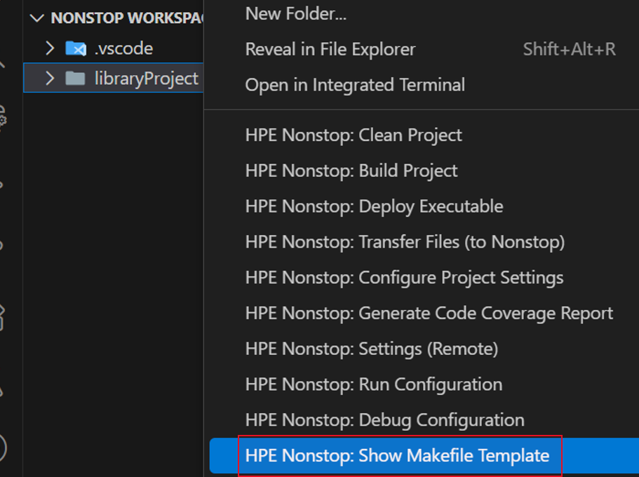
- **HPE Nonstop: Show Archive Library Template** (for static .a libraries).

- **HPE Nonstop: Show Dynamic Library Template** (for shared .so libraries).

- **HPE Nonstop: Show Link File Template** (for executables linking to libraries).
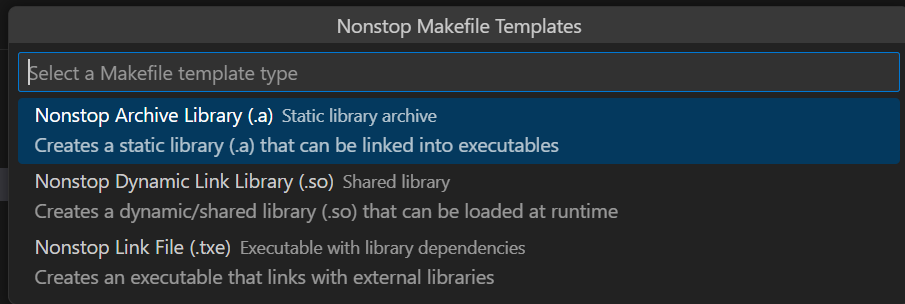
2.  **Template Generation**:

The selected template is inserted into or updates an existing Makefile in your project's root directory.

This is a starter template only—you must customize it with your specific source files, paths, and dependencies. The template provides placeholders and basic rules, but does not auto-populate based on your project files.

**Key Fields and Customization**:

- **Source Files**: Manually list your library source files (e.g., LIB_SRCS := src/libfunc.c).

- **Object Files**: Corresponding objects (e.g., LIB_OBJS := src/libfunc.o).

- **Library Name**: Specify the output name (e.g., LIB_NAME := mylib).

- **Compiler Flags**: Include necessary flags like -Wcall_shared for dynamic libraries.

- **Include Paths**: Add -I flags for headers.

- **Dependencies**: List any external libraries to link against.

- **Build Rules**: Customize targets like all, clean, and library-specific rules (e.g., ar rcs for archives).

- **Configure Project Settings**:

- After generating the template, right-click the project folder and select **HPE Nonstop: Configure Project Settings**.

- In the [**Initial Build Settings Page**](#initial-build-settings-page):

  - **Uncheck** the **Generate Makefile Template** box (since you've already generated the library template).

  - Select the **Compiler Version** and other relevant options (e.g., **System Type**).

- Click **Next** to proceed to the [**Remote Settings Page**](#remote-settings-page).

- Configure remote paths, connections, and deployment options as needed.

- Click **Save Settings** to apply the configuration without regenerating the Makefile.

**Review and Build**:

- Open the generated Makefile template and edit it to match your library's requirements (e.g., add source files, adjust paths).

- Use VS Code's terminal or build commands to test compilation.


---

# Building a project

To build a project using Make in VS Code on Windows, you must have Cygwin installed, as they provide the make utility. Ensure the path to the bin directory containing the make program is included in your system's PATH environment variable. For detailed steps, see [Configure cygwin](#configure-cygwin).

In VS Code, you can also set environment variables per workspace or globally in your user settings (settings.json). For example, to prepend a path, add:

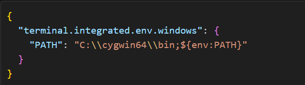
## Building Process

To build your project:

- Right-click on the project in the VS Code Explorer.

- Select **HPE Nonstop: Build Project**.
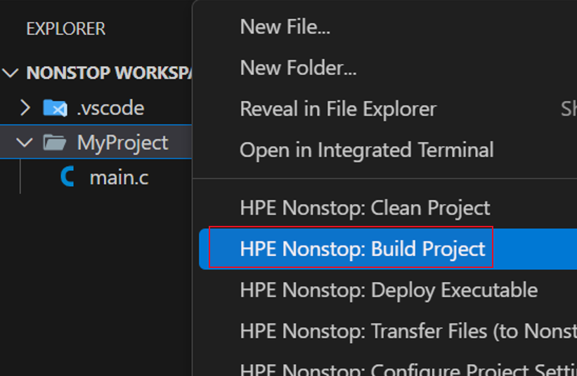
- Alternatively, open the Command Palette (Ctrl+Shift+P), type "HPE Nonstop", and select **HPE Nonstop: Build Project** and then select the project.
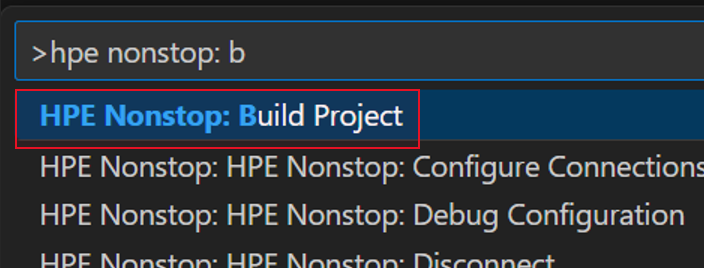
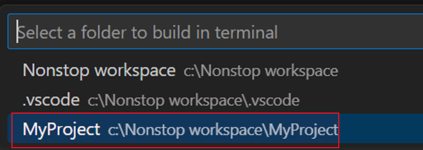
- This action:

  - Creates and opens a new terminal window titled with the project name.

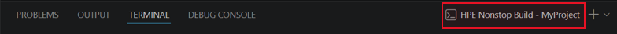
- Searches for the Makefile in the project directory.

- Sets the COMP_ROOT environment variable based on the compiler version configured in your project settings.

- Runs the make all command to build the project.

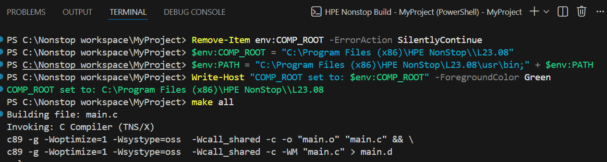


---

# Deploying a project

For deployment, the extension automatically manages the connection setup, transfers the executable, and configures the necessary permissions.

**Deploying Process**

To deploy an executable:

- Right-click on the project in the VS Code Explorer.

- Select HPE Nonstop: Deploy Executable.
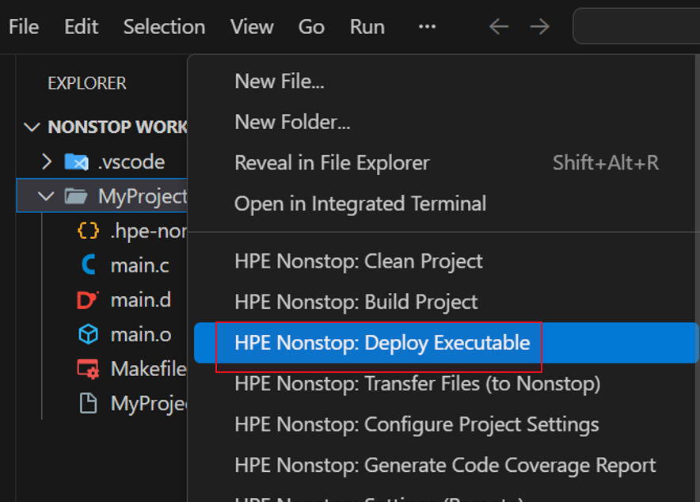
- Alternatively, Open the Command Palette (Ctrl+Shift+P).

- Type "HPE Nonstop" and select HPE Nonstop: Deploy Executable.

- When prompted, select the project folder from the list. 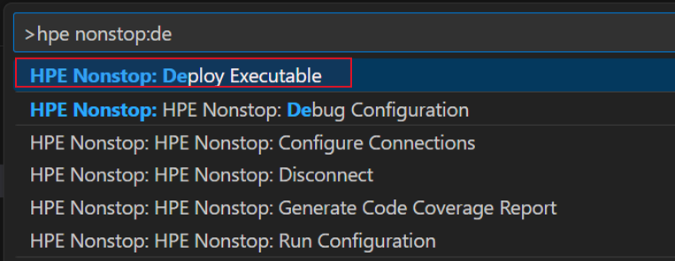 

- This action:

  - Scans the project folder for executable files.

  - If multiple executables are found, displays a selection dialog to choose which one to deploy.

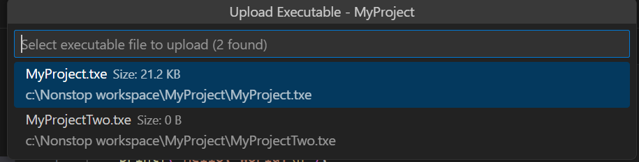
- Checks if the selected connection is active; if not, establishes the connection first.

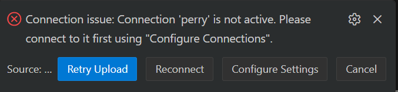
- When deploying an executable, the file is transferred to the remote system defined on the [Remote Settings page](#remote-settings-page). If you specify a target file name in Remote Settings, the executable will be renamed on the remote host to that target name.

- If no target file name is provided, the executable is copied using its original (default) filename. For example, mytool.exe uploaded without a configured target name remains mytool.exe on the remote system.

- Guardian naming rules: when using a Guardian-style target name, the name is limited to 8 characters for the filename portion only — the limit does not include the file extension.

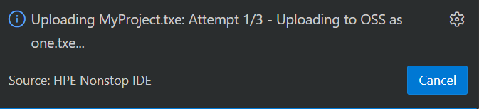
- Sets correct execute permissions on the remote system for the deployed executable.

Monitor the terminal output for deployment results. If errors occur, review the Remote Settings and connection configuration. Successful deployment allows you to run the executable on the Nonstop system.

**Note for SQL/MP Projects**:  
For SQL/MP projects, the deployment process differs. When the **Deploy Executable** action is triggered, the extension executes the make deploy command for the project. The deployment is performed according to the rules specified in the Makefile.
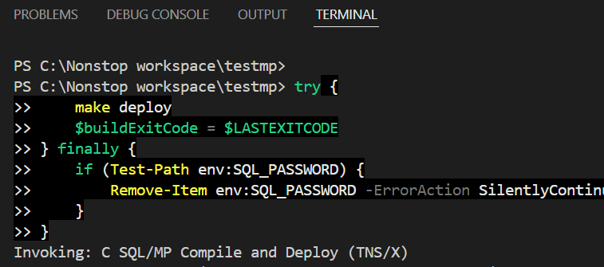


---

# Launching a Project

**About this task**

The steps for launching a project are similar for all types of projects in the extension.

To open the run configuration page from the extension, follow these steps:

## Procedure

- Option 1 : Right-click on the project in the VS Code Explorer and select HPE Nonstop: Run Configuration. On clicking, it provides a default name for the configuration, such as "Run project_name", which can be changed.
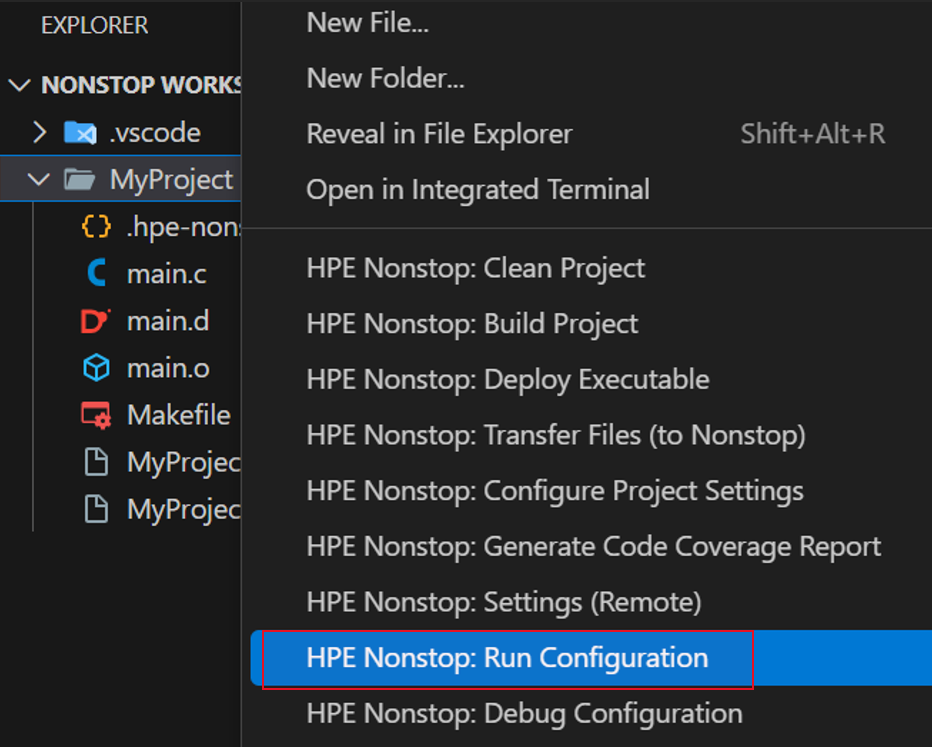
- Option 2: Open the Command Palette (Ctrl+Shift+P), type "HPE Nonstop", and select HPE Nonstop: Run Configuration.
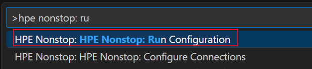
- Option 3: Open the Nonstop Tools view in the Activity Bar, expand the Run Configuration section, and click on Configure Run. Then, select the desired project to configure the run settings.
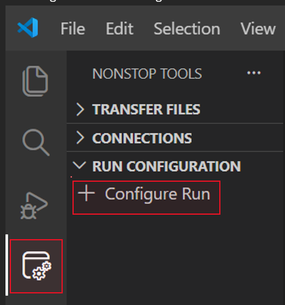
## Launching a Nonstop Application from the Extension

To launch a Nonstop application, create a run configuration using the Run Configurations dialog.

After a run configuration is created and saved, it can be used to run applications.

The following sections describe:

- Creating a run configuration

- Launching an application using a saved run configuration

### Creating a Run Configuration

To create a run configuration, perform the following steps:

- From the Run Configurations page select Create New Configuration from the context menu. This creates a new run configuration.
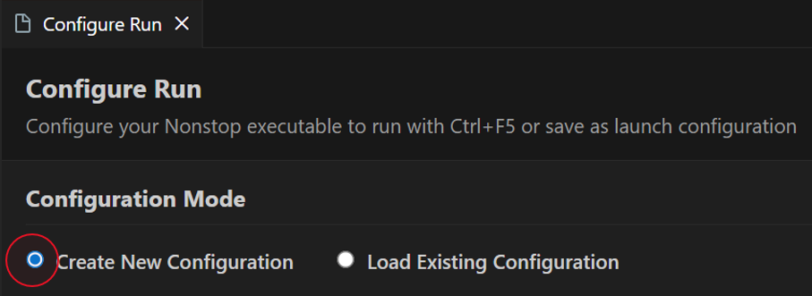
- In the Name field above the tabbed pages, enter a name for your new run configuration (or leave the default, Run project_name).
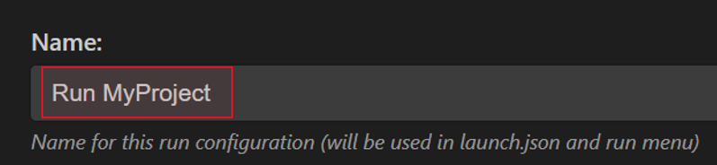
- In the Main tabbed page:

  - Enter the location of the project in the Nonstop project field (or select Browse to select from a list of projects).

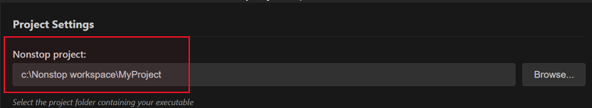
- Select the launch type (OSS or Guardian).
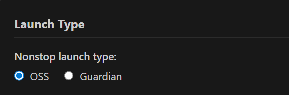
- Select a system from the Nonstop system dropdown.

- Enter a path to the executable you want to run in the Nonstop executable's path on Nonstop system field (or select Browse to browse for executables on the remote system).

- Optional: If the program you want to run is on your local Windows system and you want to transfer it to the Nonstop system prior to launching it, select the checkbox for Local executable to be transferred to Nonstop path specified above, then enter the local path of the executable (or select Browse to browse for the executable).
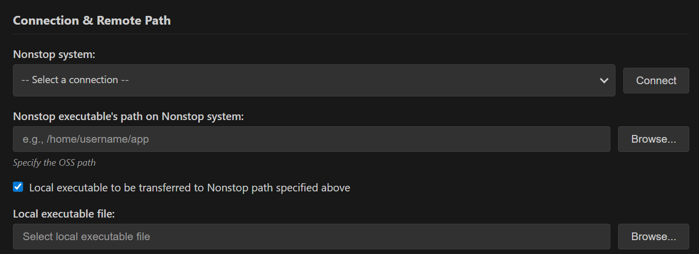
- To enter run command options, program arguments, or to select a non-default remote working directory:

- Select the Arguments tab to show the Arguments page.

  - Enter run command options in the Run command options text field. You can enter options on more than one line, as any new lines will be converted to spaces when your program is run.

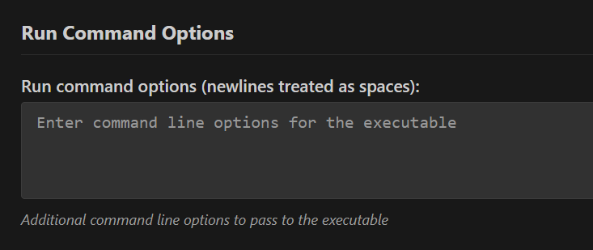
- Enter program arguments in the Program arguments text field. You can enter arguments on multiple lines, as any new lines will be converted to spaces when your program is run.

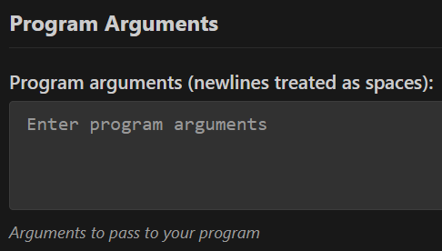
- Select the working directory based on the platform you are using. For Guardian systems, choose the initial \$volume.subvolume as the working directory. For OSS platforms, select Set working directory to define the program’s working directory. If you need to choose a different location, click Browse to navigate the remote system and select the desired directory.

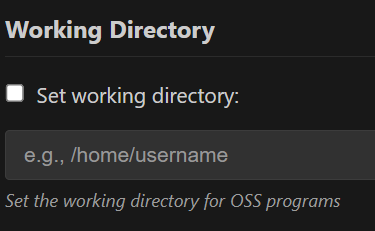
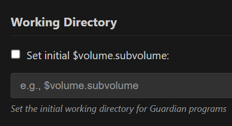
- Optional: To set environment variables (OSS) or DEFINEs, ASSIGNs, and PARAMs (Guardian) prior to launching your application:

  - Select the Environment tab to show the Environment page.

  - Use the input box to directly enter the environment variable settings (OSS) or DEFINEs, ASSIGNs, and PARAMs settings (Guardian).
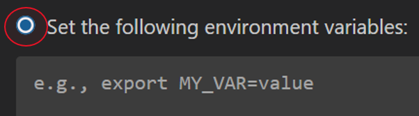
- For OSS, these settings will be issued directly in the shell. Be sure to use export so that your application will inherit settings, as in, for example:

```bash
export MY_PROGRAM_VAR="somevalue"
```

- For Guardian DEFINEs, ASSIGNs, and PARAMs, list them as you would enter them at a TACL prompt.

- Alternatively, you can specify your environment settings in a file on the remote system, check the Set environment variables contained in remote file checkbox, and below the checkbox enter the path of the remote file (or select Browse to browse for it).

  - For OSS, the remote file is executed using this syntax:

\$ . /path/to/remote/file

- For Guardian, the remote file is executed using obey:

TACL\>obey \$volume.subvol.rfile
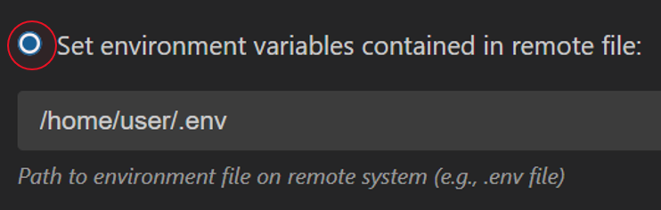
- To save your new run configuration, you can select  Create Run Configuration button at the bottom, which will save the run configuration to launch.json. Alternatively, you can select Run button to launch immediately without saving.

### Launching an Application Using a Saved Run Configuration

After you save a run configuration, you can reuse it to launch your application without having to re-specify the details of the launch.

For example, if you named your run configuration "Run MyProject", you could then launch your application in the following way:

- Using Run and Debug Activity bar

  - In the left sidebar, click the Run and Debug button.

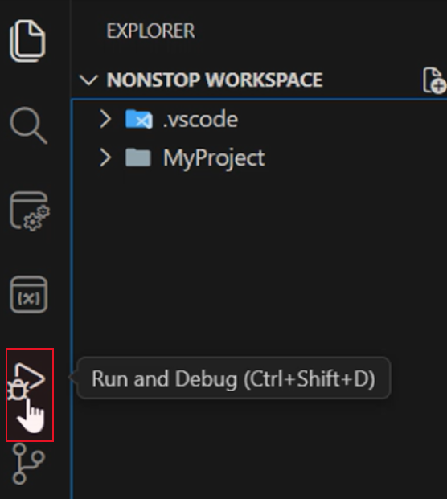
- From the dropdown at the top, select the saved configuration (e.g., "Run MyProject").

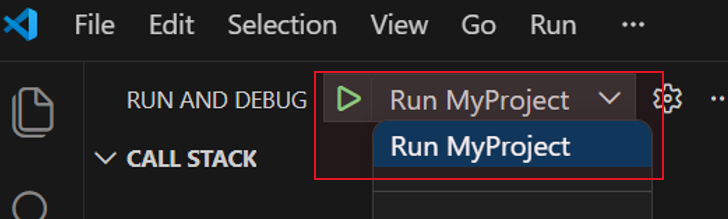
- From the top panel Click Run \> Run without Debugging or Click Cntrl+F5  (configurations can only be run this way; using debug mode will cause errors).
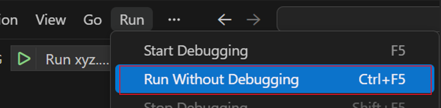
- Using Nonstop Tools Activity bar

  - In the left sidebar, click the Nonstop Tools button.

  - Under the Run Configuration section, locate the desired configuration (e.g., "Run MyProject").

  - Hover over the configuration and click the Run button (▶) displayed next to it.

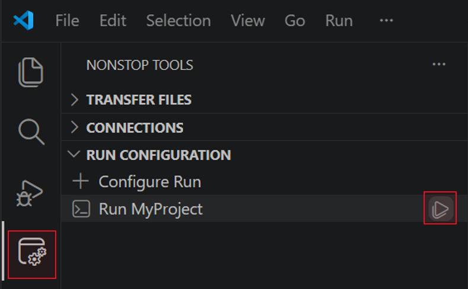
- This will execute the selected run configuration directly.

<!-- -->

- The output appears in the terminal. To stop, click the stop button in the debug controls.
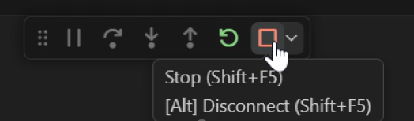


---

# Code Coverage

The Code Coverage tool is used to generate code coverage reports.

## Prerequisites

Before generating code coverage reports, ensure the following:

- In the [Configure Project Settings](#opening-the-configure-project-settings-page), the Enable Code Coverage option is checked.

- Required options for Profmrg and Codecov commands are provided in the project settings.
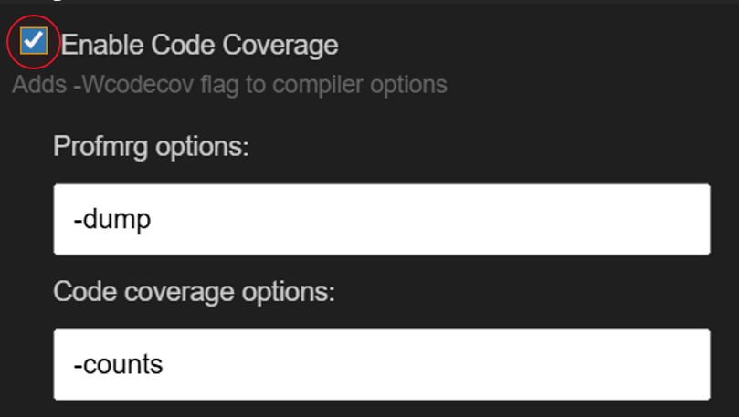
## Code Coverage Basics

Code coverage reports are generated based on the execution of instrumented code on remote Nonstop systems using the Generate Code Coverage tool. It simplifies the process of report generation for all local projects.

While creating a new project, you can enable code coverage and provide options for Profmrg and Codecov commands.

After a TNS/X project is built and executed, raw data files are generated. However, raw data files are not generated until the executable is run on the target system.

The Profmrg and Codecov targets are added to the Makefile. These targets contain the corresponding commands and options as set in the project settings (see step 7 in [Creating a Project from Scratch](#creating-a-project-from-scratch)).

Figure 1. Sample of Profmrg and Codecov targets

```makefile
profmrg: makefile objects.mk $(OPTIONAL_TOOL_DEPS)
@echo 'Invoking: Profmrg Tool'
profmrg $(profmrg_options)
@echo 'Finished building: $@'
@echo ' '
codecov: profmrg makefile objects.mk $(OPTIONAL_TOOL_DEPS)
@echo 'Invoking: Code coverage Tool'
codecov $(codecov_options)
@echo 'Finished building: $@'
@echo ' '
```

Raw data files are generated after the final executable is deployed and run on the remote machine. On OSS platform, raw data files are saved with \*.dyn extension. On Guardian platform, raw data files are stored with ZZPF\* extension.

The code coverage report is generated using the raw data files on remote Nonstop system.

## Enabling Code Coverage

### Enabling Code Coverage for new projects

**Procedure**

- Right-click on the project in the VS Code Explorer and select HPE Nonstop: Configure Project Settings.

- Alternatively, open the Command Palette (Ctrl+Shift+P), type "HPE Nonstop", and select HPE Nonstop: Configure Project Settings.

- In the [Initial Build Settings Page](#opening-the-configure-project-settings-page), check the Enable Code Coverage box.

- Optionally, specify Profmrg options (e.g., -dump) and Code coverage options (e.g., -counts).

- Click Next to proceed to the Remote Settings page, then click Complete Setup & Generate/Update Makefile to save the settings.

### Enabling Code Coverage for existing projects

Projects created with the template include code coverage by default. For existing projects, enable it using the steps below:

- Step 1: Add Compiler Flag

Add the following flag to your compiler options:

```bash
-Wcodecov
```

This enables code instrumentation for coverage tracking.

- Step 2: Update Makefile

Add these targets to your Makefile:
```bash
\# Code Coverage Targets
makefile
profmrg: makefile objects.mk $(OPTIONAL_TOOL_DEPS)
@echo 'Invoking: Profmrg Tool'

profmrg -dump

makefile
@echo 'Finished building: $@'
@echo ' '
codecov: profmrg makefile objects.mk $(OPTIONAL_TOOL_DEPS)
@echo 'Invoking: Code coverage Tool'

codecov -counts

@echo 'Finished building: $@'
@echo ' '
```

- Step 3: Enable in Project Settings

Right-click project → HPE Nonstop: Configure Project Settings

Go to Code Coverage Section

Enable Code Coverage and provide required options

## Generating Code Coverage Report.

**Procedure**

- Right-click on the project and select HPE Nonstop: Generate Code Coverage Report.

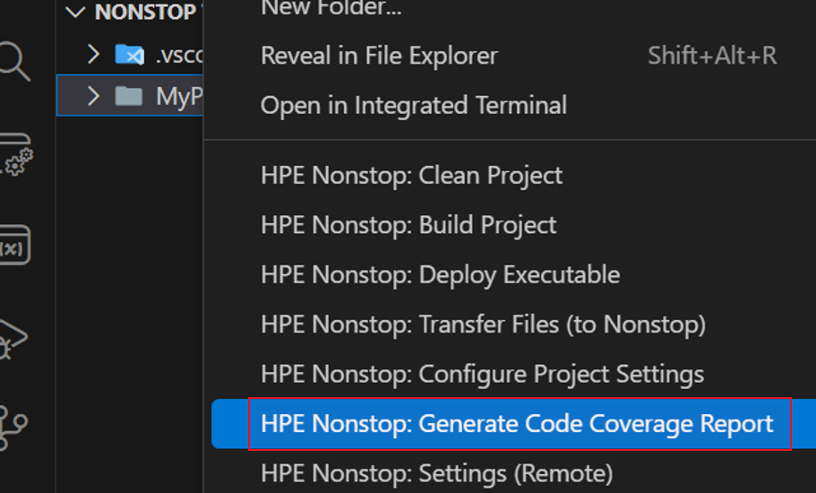
- Alternatively, open the Command Palette (Ctrl+Shift+P), type "HPE Nonstop", and select HPE Nonstop: Generate Code Coverage Report and then select the project.

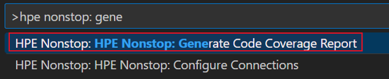

- The **Generate Code Coverage** page for the selected project appears.

- Specify the following:

  - Select OSS or Guardian platform.

  - To specify the Location, click Browse and navigate to the required location.

  - Select the check boxes corresponding to the required raw data files.

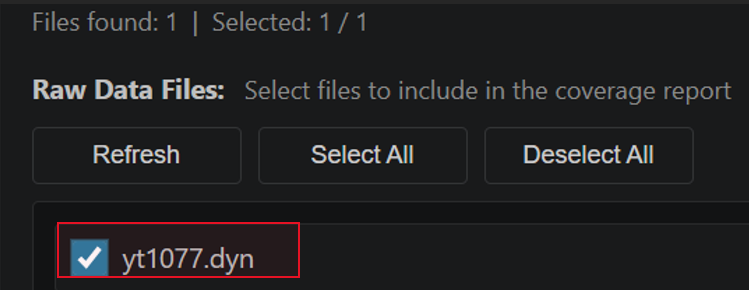
- Click Generate Code Coverage.

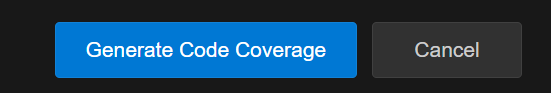
- The selected files are transferred from the remote Nonstop system to the build location of the project. The target codecov is invoked, which invokes profmrg and codecov commands in the Makefile and generates the code coverage report. The final code coverage report opens in the default HTML editor.

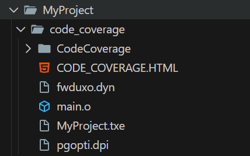


---

# Debugging a project

The debugging tasks are:

- [Preparing to debug a Nonstop Application](#preparing-to-launch-a-nonstop-application-for-debugging)

- [Preparing to launch a Nonstop Application for debugging](#preparing-to-launch-a-nonstop-application-for-debugging)

- [Creating or modifying debug configurations](#creating-or-modifying-debug-configurations)

- [Using the debug perspective for Nonstop Applications](#using-the-debug-perspective-for-nonstop-applications)

- [Debugging Nonstop Applications Using Native Inspect (xInspect) Commands](#debugging-nonstop-applications-using-native-inspect-xinspect-commands)

- [Attaching the debugger to a Nonstop process](#creating-a-new-nonstop-attach-process-debug-configuration)

- [Detaching the debugger from a Nonstop process](#detaching-the-debugger-from-a-nonstop-process)

- [Ending a Debugging Session](#ending-a-debugging-session)

- [Preferences (Run/Debug)](#debug-configuration-flow)

- [Debug configurations dialog for Nonstop debugging configurations](#debug-configuration-flow)

## Preparing to Launch a Nonstop Application for Debugging

The standard process to prepare to debug a Nonstop application is:

1.  Creating a new Nonstop Project

- Create a Nonstop project for the application using the extension's project creation wizards (see [Creating Projects](#creating-a-project-from-scratch)).

- Build a debuggable version of your application so that you can step through source and examine symbols (see [Building a Project](#building-a-project)).

2.  Using an existing project

- See [copying an existing project](#creating-a-project-from-existing-sources).

- Ensure the project contains a valid executable.

- You can directly proceed with debugging the application.

> **Note:** : The extension also supports debugging applications built outside of the extension, referred to as project less debugging.

This means that if you already have an application built on Nonstop and it includes a valid executable, you do not need to create or import a project into the workspace. Instead, you can directly debug the application.

To do this:

- Ensure the executable exists and is accessible on the Nonstop system.

- Provide the path to the executable in the debug configuration.

- Start the debugging session directly.

You must have sufficient privilege to debug the target process. When debugging a program file that has been secured with the PROGID setting, you must either debug as the owner of the program file or as a privileged user.

Before you can debug a Nonstop application, you must build a debuggable version of your application so that you can step through the source and examine symbols. For information, see Debugging optimized code.

If you want to reuse an existing Nonstop Application debug configuration and do not need to modify it, in the Run and Debug sidebar, in the configuration’s dropdown, select the debug configuration you want to use and click **Start Debugging**.

To create a new Nonstop Application debug configuration, see [Creating a New Debug Configuration](#creating-a-new-nonstop-application-debug-configuration).

To modify an existing Nonstop Application debug configuration, see [Modifying an Existing Debug Configuration.](#modifying-an-existing-nonstop-application-debug-configuration)

To specify options for the debugger, enter the information in the Debugger tab. [See Specifying Debugger Options](#specifying-debugger-options).

## Creating or modifying debug configurations

This topic describes how to create or modify debug configurations using the **Debug Configurations** dialog for these debug configurations:

- Nonstop Application debug configurations

- Nonstop Attach Process debug configurations

### Nonstop Application debug configurations

**Subtopics**

- [**Creating a new Nonstop Application debug configuration**](#creating-a-new-nonstop-application-debug-configuration)

- [**Modifying an existing Nonstop Application debug configuration**](#modifying-an-existing-nonstop-application-debug-configuration)

- [**Specifying DEFINEs, ASSIGNs, and PARAMs for Guardian launch types**](#specifying-defines-assigns-and-params-for-guardian-launch-types)

- [**Specifying arguments for Nonstop Application debug configurations**](#specifying-arguments-for-nonstop-application-debug-configurations)

- [**Specifying environment variables for OSS launch types**](#specifying-environment-variables-for-oss-launch-types)

- [Specifying alternate source file locations](#specifying-alternate-source-file-locations)

- [Specifying debugger options](#specifying-debugger-options)

#### Creating a New Nonstop Application Debug Configuration
**About this task**

To debug an application for the first time, you must create a Nonstop application debug configuration for this application.

**Procedure**

- **Open the Debug Configuration Page**:

  - Option 1: Right-click on the project folder in the VS Code Explorer and select **HPE Nonstop: Debug Configuration**.

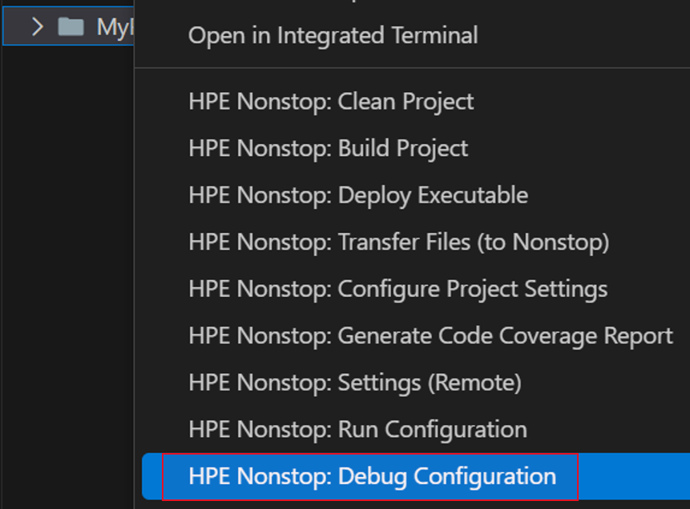
- Option 2: Open the Command Palette (Ctrl+Shift+P), type "HPE Nonstop", and select **HPE Nonstop: Debug Configuration**. Then, select the project folder from the list.

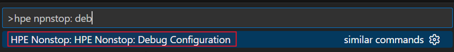
- Option 3: Open the Nonstop Tools view in the Activity Bar, expand the Debug Configuration section, and click on Configure Debug. Then, select the desired project to configure the debug settings.
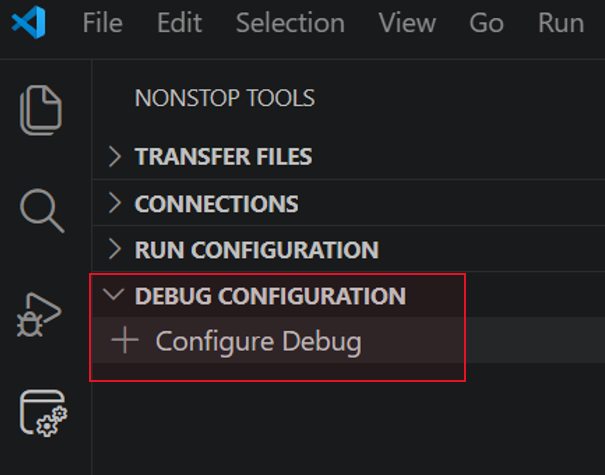
- This opens the Debug Configuration dialog.

- **Select Configuration Mode**:

  - Choose **Create New Configuration** to create a new debug configuration.

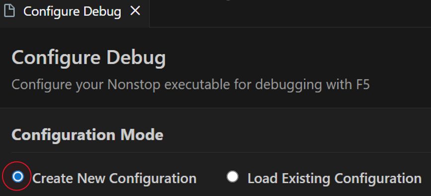
- **Enter Configuration Name**:

  - When debug configuration dialog is opened a new configuration appears with a default name—such as "Debug project_name" for launch mode or "Attach project_name" for attach mode—which you can keep or rename to something more meaningful in the Name field.

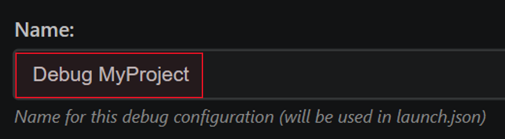
- **Select Request Type**:

  - Choose **Launch** to start a new process for debugging.

  - Choose **Attach** to attach to an existing running process.

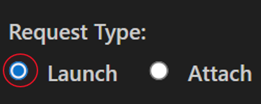
- **Configure the Main Tab**:

  - For **Nonstop project**, specify the project that was used to build the application. Enter the project name or click **Browse** to select it. This is optional field.

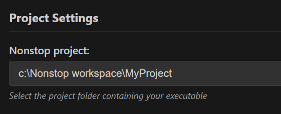
- For **Nonstop launch type**, select **OSS** if your application is an OSS application or **Guardian** if your application is a Guardian application.

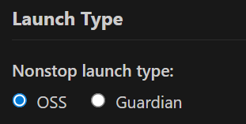
- For **Nonstop system**, select a previously configured connection from the dropdown, or click **[Configure Connections](#configuring-connections)** to add or edit connections.

- For **Nonstop executable's path on Nonstop system**, enter the full path to the executable file on the Nonstop system, or click **Browse** to locate it remotely.

- Optionally, check **Local executable to be transferred to Nonstop path specified above** and specify the local executable path to transfer it before debugging.

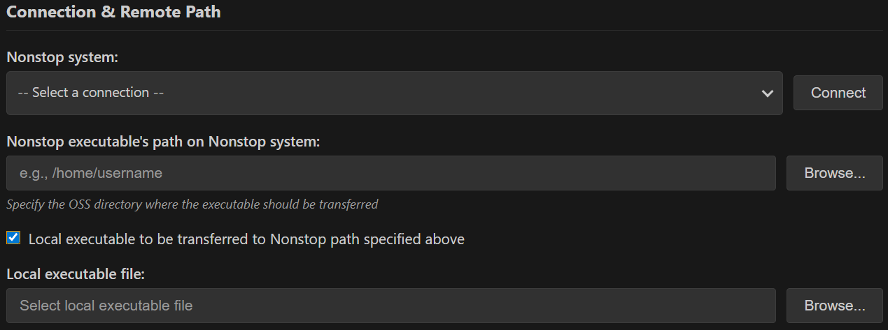
- **Optional: Configure the Arguments Tab**:

  - Enter run command options, program arguments, and working directory settings. See [Specifying Arguments for Nonstop Application Debug Configurations](#specifying-arguments-for-nonstop-application-debug-configurations).

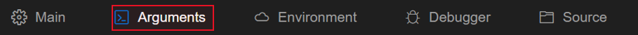
- **Optional: Configure the Environment Tab**:

  - Specify environment variables (OSS) or DEFINEs, ASSIGNs, and PARAMs (Guardian), or use a remote environment file.

  - If this is a Guardian launch type, see [Specifying DEFINEs, ASSIGNs, and PARAMs for Guardian Launch Types](#specifying-defines-assigns-and-params-for-guardian-launch-types).

  - If this is an OSS launch type, see [Specifying Environment Variables for OSS Launch Types](#specifying-environment-variables-for-oss-launch-types).

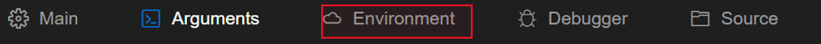
- **Optional: Configure the Debugger Tab**:

  - Specify debugger options, such as stopping at main entry point or a specific function, and enable privileged code access. See [Specifying Debugger Options](#specifying-debugger-options).

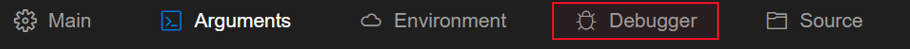
- **Optional: Configure the Source Tab**:

  - By default, the debugger searches for source files at the path recorded when the application was compiled. If you need to specify a different location, such as when you have moved the files to a different system, use the **Source** tab to specify the current location of the files. A rule must be specified, either the default or alternate locations. [See Specifying Alternate Source File Locations](#specifying-alternate-source-file-locations).

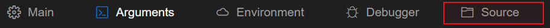
- **Launch or Save the Configuration**:

  - Click **Debug** to start debugging immediately without saving the configuration to launch.json.

  - Click **Create Debug Configuration** to save the configuration to launch.json for future use.

The extension applies your settings and launches the debugger. Monitor the terminal for output and use the debug controls to step through your code.

#### Modifying an Existing Nonstop Application Debug Configuration
**About this task**

To modify an existing Nonstop Application debug configuration:

**Procedure**

**See [Open the Configure Debug Page](#creating-a-new-nonstop-application-debug-configuration)**

**Select Configuration Mode**:

- Choose **Load Existing Configuration**.

- From the dropdown, select the debug configuration you want to modify.

- When an existing configuration is loaded, the Delete button becomes enabled.

- Use the Delete button to remove the selected configuration from the launch.json file if it is no longer needed.
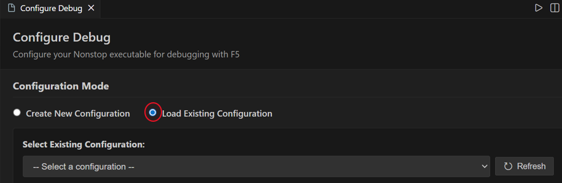
**Modify the Configuration**:

- Edit the fields in the tabs as needed (Main, Arguments, Environment, Debugger, Source).

- If you want to change the name, update the **Name** field.

**Save the Changes**:

- Click **Create Debug Configuration**.

- When prompted, choose whether to **Update Existing Configuration** or **Create New Configuration**.

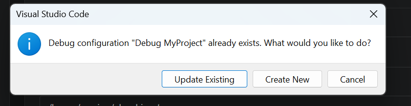

Alternatively, if you want to debug without saving the modified configuration, click Debug to start debugging immediately with the current changes.

The extension applies your changes and saves the configuration to launch.json. Monitor the terminal for output and use the debug controls to step through your code.

#### Specifying Arguments for Nonstop Application Debug Configurations
**About this task**

You can use the Arguments tab to specify the following:

- The options used by the run command when a program is launched.

- The arguments to pass to the application.

- A working directory other than your home directory.

**Procedure**

**Specify Run Command Options**:

- Enter them in the box after **Run command options** (newlines treated as spaces).

- The syntax must be valid for the option selected for **Nonstop launch type** in the Main tab; either OSS or Guardian. For the Guardian launch type, you are not required to use opening and closing forward slashes. The extension does not validate this syntax.

  - For OSS

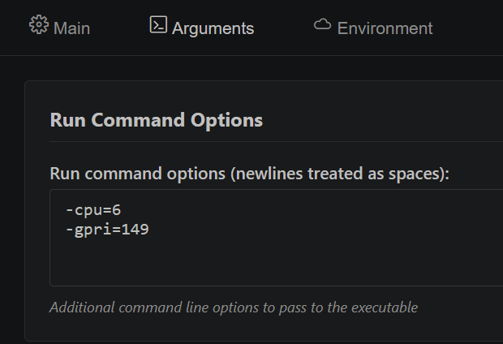
- For Guardian

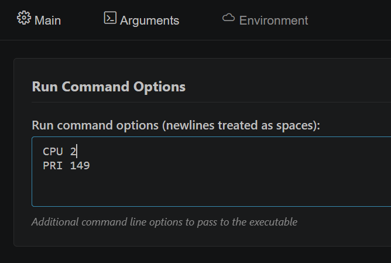
> **Note:** : The debug, nowait, and term options are not supported.

You can use the cpu option to specify on which processor the application and the debugger should run. If you specify this option, it is used for both the debugger and the target application. If you do not use the cpu option, the application and debugger are run in a processor that is chosen by the system.

**Specify Program Arguments**:

- Enter them in the box after **Program arguments** (newlines treated as spaces).

- The syntax must be valid for the program being debugged. The extension does not validate this syntax.
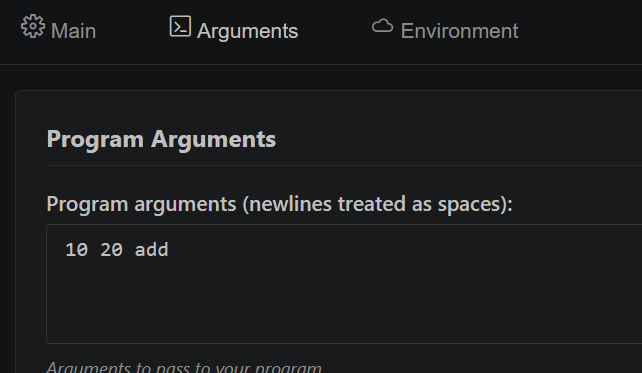
**Specify Working Directory**:

- By default, your home directory is used as the working directory.

- To specify a different directory:

  - For OSS launch types, select **Set working directory**.

  - For Guardian launch types, select **Set initial \$volume.subvolume**.

- Enter the full path and directory name in the box or click **Browse** to locate and select the directory or volume and subvolume.
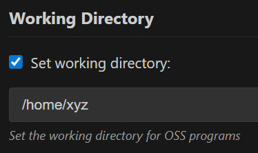
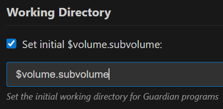
**Apply Changes**:

- Click **Create Debug Configuration** to save the configuration to launch.json.

- Click **Debug** to start debugging immediately without saving.

#### Specifying DEFINEs, ASSIGNs, and PARAMs for Guardian launch types
You can specify DEFINEs, ASSIGNs, and PARAMs for Guardian launch types using the **Environment** tab of the **Debug Configurations** dialog. These settings are used for this debug configuration only (they are not stored in your TACLCSTM file, for example).

To specify DEFINEs, ASSIGNs, and PARAMs manually, select **Set the following DEFINEs, ASSIGNs, and PARAMs** and enter them in the box. Separate entries by entering each on its own line.
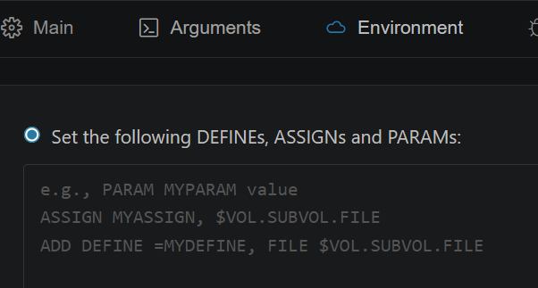
If you would like to use a set of DEFINEs, ASSIGNs, and PARAMs that are stored in a file, you can select **Set DEFINEs, ASSIGNs, and PARAMs contained in remote file** and either enter the full path and name of the file in the box or click **Browse** to locate and select the file.
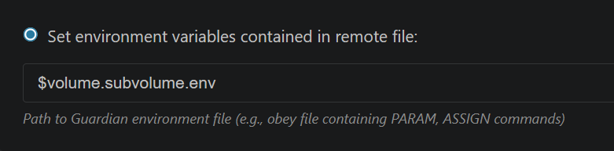
> **Note:** 

Enter DEFINEs, ASSIGNs, and PARAMs exactly as you would enter them at the TACL prompt. For example:
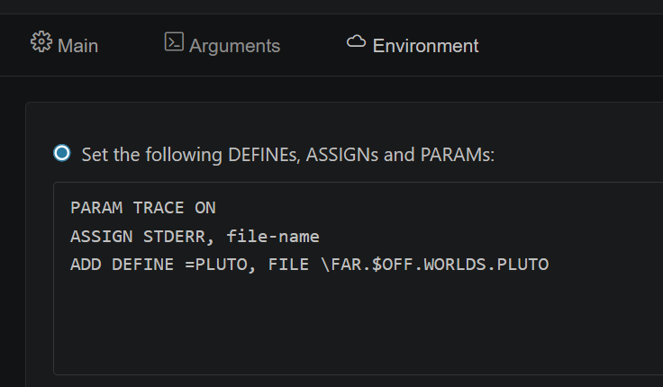
#### Specifying Environment Variables for OSS Launch Types
**About this task**

You can specify OSS environment variables for OSS launch types using the Environment tab of the Configure Debug page. These environment variables are used only for the shell session used with this debug configuration (they are not stored in your .profile file, for example).

**Procedure**

**Specify Environment Variables Manually**:

- First, select the “Set the following environment variables:” radio button.

- In the input box, enter the variable name and value in the format name=value.

- Environment variables must be entered exactly as you would set them in a shell.

<!-- -->

- For example, to set TESTMODE=1, you must enter:

  - `export TESTMODE=1`

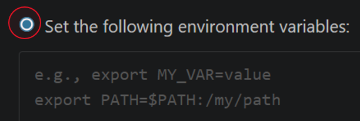
**Specify Environment Variables from a File**:

- Select **Set environment variables contained in remote file**.

- Enter the full path and name of the file in the box, or click **Browse** to locate and select the file on the remote system.

- The file should contain environment variable settings in shell format (e.g., export VAR=value).

- **Note**: Enter environment variables exactly as you would set them in a shell. For example, if you set the environment variable TESTMODE by entering:

```bash
TESTMODE=1 your setting will not be available to your application. Instead, you must enter:
```

- `export TESTMODE=1`
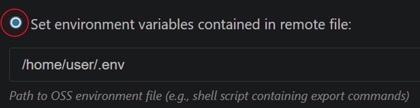
### Nonstop Attach Process debug configurations

**Subtopics**

- [**Creating a new Nonstop Attach Process debug configuration**](#creating-a-new-nonstop-attach-process-debug-configuration)

- [**Modifying an existing Nonstop Attach Process debug configuration**](#modifying-an-existing-nonstop-attach-process-debug-configuration)

#### Creating a New Nonstop Attach Process Debug Configuration
**About this task**

To debug an existing running process on a Nonstop system, you must create a Nonstop Attach Process debug configuration. This allows you to attach the debugger to a process that is already running.

**Procedure**

**Open the Configure Debug Page**:

- Right-click on the project folder in the VS Code Explorer and select HPE Nonstop: Debug Configuration. See [other options](#creating-a-new-nonstop-application-debug-configuration).

**Select Configuration Mode**:

- Choose **Create New Configuration**.

**Enter Configuration Name**:

- In the **Name** field, enter a meaningful name for this debug configuration, or use the default Attach \<project-name\>.

**Select Request Type**:

- Choose **Attach**. This changes the Main tab to show attach-specific options.
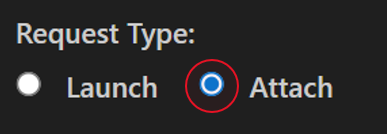
**Configure the Main Tab**:

- For **Nonstop launch type**, select **OSS** if the process is an OSS process or select **Guardian** if the process is a Guardian process.

- For **Nonstop system**, select a connection from the dropdown.

- For **Nonstop Process**, specify the process to attach to by **CPU, PIN**. Enter the process details in the format CPU,PIN (e.g., 1,234).

- Enter the process details in the required format; if the input is missing or invalid, an error is displayed and the Debug option is disabled. Alternatively, click Browse to open the Process Browser, select a running process, and click OK to populate the CPU and PIN in the Main tab.

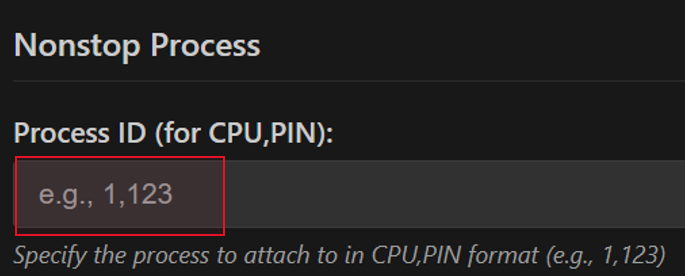
- In the Process Browser, you can also search for a specific process using the available fields (such as CPU,PIN, PID, User) to quickly locate the required entry.

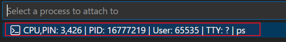
- **Optional: Configure the Debugger Tab**:

  - Specify debugger options, such as stopping at main entry point or a specific function and enable privileged code access. See [Specifying Debugger Options](#specifying-debugger-options).

- **Optional: Configure the Source Tab**:

  - Specify alternate source file locations if the default paths are not correct. [See Specifying Alternate Source File Locations](#specifying-alternate-source-file-locations).

- **Launch or Save the Configuration**:

  - Click **Debug** to attach to the process immediately without saving the configuration to launch.json.

  - Click **Create Debug Configuration** to save the configuration to launch.json for future use.

The extension attaches the debugger to the specified process. Monitor the terminal for output and use the debug controls to step through your code. If the process is not found or access is denied, check the process details and connection settings.

#### Modifying an Existing Nonstop Attach Process Debug Configuration
**About this task**

To modify an existing Nonstop Attach Process debug configuration:

**Procedure**

- **Open the Configure Debug Page**

- **Select Configuration Mode**:

  - Choose **Load Existing Configuration**.

  - From the dropdown, select the debug configuration you want to modify.

- **Modify the Configuration**:

  - Edit the fields in the tabs as needed (Main, Debugger, Source).

  - If you want to change the name, update the **Name** field.

- **Save the Changes**:

  - Click Create Debug Configuration to save the configuration.

  - When prompted, choose whether to Update Existing Configuration or Create New Configuration.

- Alternatively, if you want to debug without saving the modified configuration, click Debug to start debugging immediately with the current changes.

The extension applies your changes and saves the configuration to launch.json. Monitor the terminal for output and use the debug controls to step through your code.

### Specifying Alternate Source File Locations

**About this task**

By default, the debugger looks for source files at their compile-time location. If the source files are not available at their compile-time location, you can use the Source tab to direct the debugger to search in alternate locations.

> **Note:** : In most cases, the default path is the correct path. You only change entries in the Source tab if you have moved the source files since the application was compiled.

The Source Lookup Path list contains the categories of rules that have been configured for this debug configuration. Initially, only the default rule is configured. The default rule is a Local Compile-Time File Path, which specifies that the debugger looks for source files using compile-time paths on the local system. This default rule is implicit and is not displayed in the list.

The debugger performs source lookups by applying the rules in the Source Lookup Path list, in order. The debugger stops traversing the list when a match is found.

To add or remove entries from the list, use the Add and Remove buttons to the bottom of the list. To edit existing entries, select Edit.

**Adding Source Lookup Paths**

- To add an entry to the Source Lookup Path list in the Source tab, click the Add button to the bottom of the list.

- The Add Source dialog appears.

- From this dialog, you can select and add the supported types of source lookup rules.
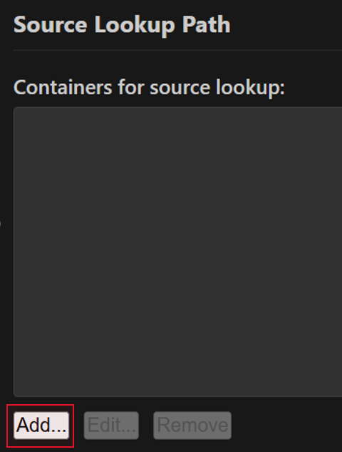
> **Note:** : The extension supports Local Directory and Local Path Mapping for source lookup.

| To look for source files in | Select this rule type and click OK | This happens next |
|----|----|----|
| A local directory that you will specify | Local File System Directory | The Add File System Directory dialog is displayed. Follow the instructions in [Adding a Local Directory](#adding-a-local-directory). |
| On the local system using a path derived by substituting part or all of a file's compile-time path with a replacement path. | Local Path Mapping | A new path mapping entry is added to the list of entries in the Source tab, but this new entry does not have any mappings associated with it. To add path mappings to a path mapping entry, select the path mapping entry in the list in the Source tab and click Edit. The Path Mappings dialog is displayed. Follow the instructions in [Creating and Editing Path Mapping Lookups](#creating-and-editing-path-mapping-lookups). |

#### Adding a Local Directory
**Procedure**

- In the Add Source dialog select Local Directory.

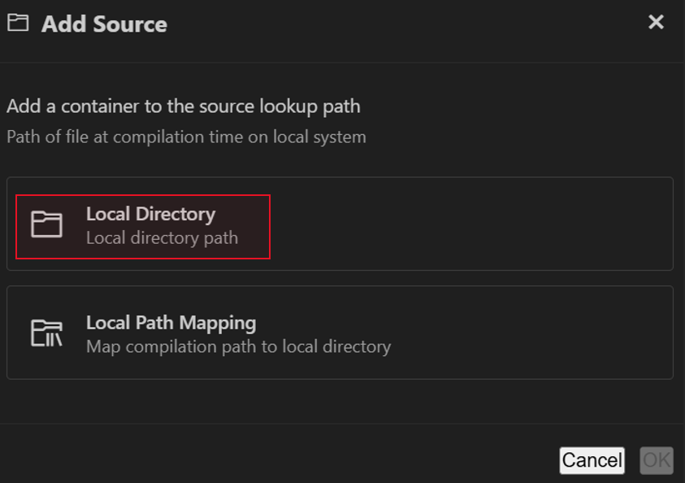
- In the Add File System Directory dialog, specify the folder and whether subfolders should be searched.

- In the Directory field, enter the local directory path or click Browse to locate and select it.

- Check the **Search subfolders** box if you want the debugger to search subdirectories.

- Click OK to add the local directory to the Source Lookup Path list.
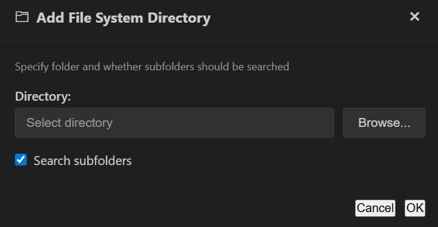
#### Creating and Editing Path Mapping Lookups
**About this task**

Path mappings tell the debugger to replace part of a source file's compile-time path with another path and to use the resulting path to search for source files. For example, suppose your source files were located in C:\Projects\myproj when you compiled the program, but later you moved the sources to C:\Archive\FY09\myproj. By creating a path mapping of C:\Projects to C:\Archive\FY09, you tell the debugger to substitute C:\Archive\FY09 whenever it looks for a source path that starts with C:\Projects.

**Procedure**

**Create a container for the path mapping entries**:

- To the bottom of the Source Lookup Path list, click **Add**.

- The Add Source dialog appears.

- Select **Local Path Mapping**.

- Click **OK**.
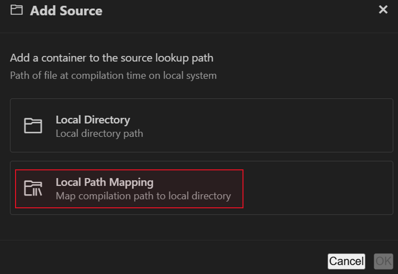
**Add one or more path mappings to the container**:

- The Local Path Mappings dialog appears.

- (Optional) Change the name of the mapping container by editing the **Name** box.

- In **Compilation path**, enter the portion of the original compile-time path that you want to replace (e.g., C:\Projects).

- In the **Local file system path** box, enter the replacement path (e.g., C:\Archive\FY09) or click **Browse** to locate and select it.

- Click **OK** to apply your changes and close the dialog.

- Click add to add more mappings if needed.

- Click **OK** to apply your changes and close the Local Path Mappings dialog.
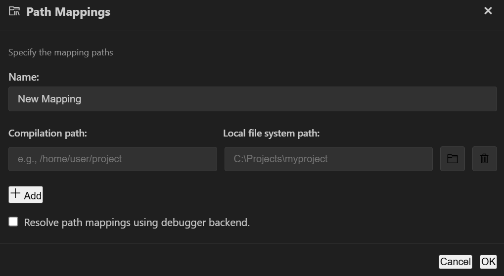
The path mappings are added to the Source Lookup Path list and will be used by the debugger to locate source files.

### Specifying Debugger Options

**About this task**

You specify debugger options for a debug configuration using the Debugger tab.

**Procedure**

**Use Default Debugger**:

- The **Use default debugger** option is selected by default. This uses the standard debugger provided with the extension.
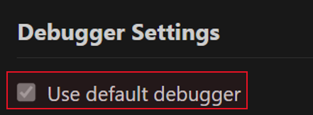
**Stop at Entry Point**:

- By default, radio button **Stop at main entry point after launch** is selected.

- To specify a function at which to stop before the main entry point is reached, select **Stop at the following function after launch** and enter the name of the function in the box.
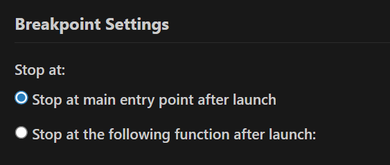
**Enable Privileged Access**:

- By default, this checkbox is not selected.

- In the Advanced Options section, select the Enable access to privileged code and data checkbox to enable debugging of privileged code and data.
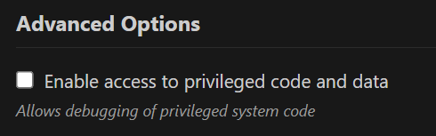
### Debugging an Application Using a Saved Debug Configuration

After you save a debug configuration, you can reuse it to debug your application without having to re-specify the details.

For example, if you named your debug configuration "Debug MyProject", you could then debug your application in the following way:

- Using Run and Debug Activity bar

  - In the left sidebar, click the Run and Debug button.


- From the dropdown at the top, select the saved configuration (e.g., "Debug MyProject").

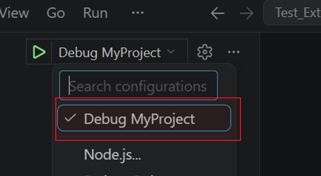
- Click on the run button or from the top panel Click Run \> Start Debugging or Click F5 .

<!-- -->

- Using Nonstop Tools Activity bar

  - In the left sidebar, click the Nonstop Tools button.

  - Under the Debug Configuration section, locate the desired configuration (e.g., "Debug MyProject").

  - Hover over the configuration and click the Run button (▶) displayed next to it.

  - This will execute the selected debug configuration directly. 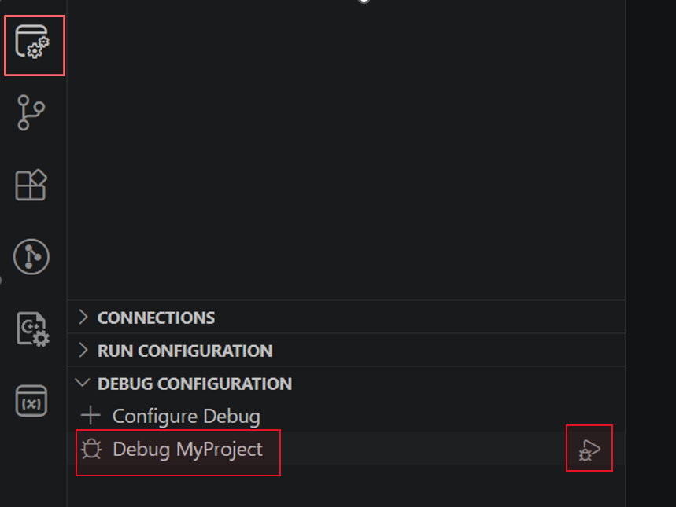

- The output appears in the terminal. To stop, click the stop button in the debug controls.

## Using the Debug Perspective for Nonstop Applications

The debugging experience for Nonstop applications in VS Code is integrated into the Run and Debug sidebar and the editor. VS Code provides a comprehensive debugging environment similar to other IDEs, with views for inspecting code, variables, and execution flow.

### Debug Interface Overview

The main debugging interface includes:

- Click on **Run and Debug Sidebar**

- **Run and Debug Container**: Shows the call stack, variables, and breakpoints.
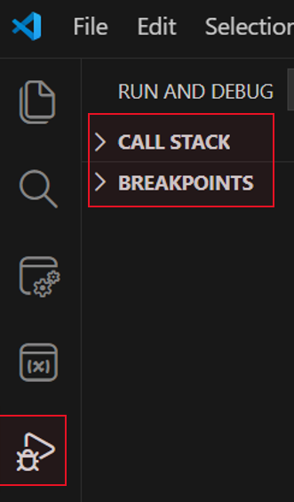
- **Editor**: Displays source code with breakpoints and current execution line.
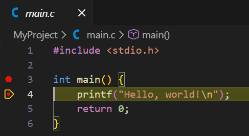
- **Debug Console**: Shows debugger output and allows executing debug commands.
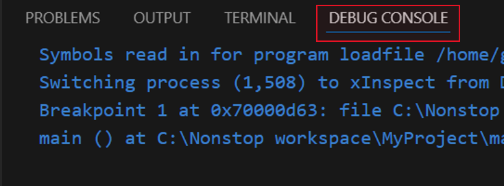
- **Terminal**: Displays program output and allows interaction with the running application.
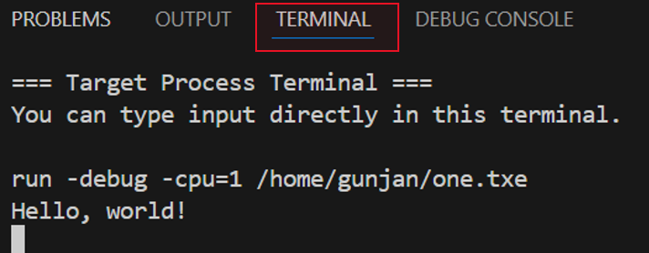
### Common Debugging Tasks

- [**Inspecting the Stack**](#inspecting-the-stack)

- [**Controlling Execution**](#controlling-execution)

- [**Setting Breakpoints**](#setting-breakpoints)

- [**Inspecting and Modifying Variable Values**](#variables-view)

- [**Setting Watch Expressions**](#watch-view)

- [**Ending a Debugging Session**](#ending-a-debugging-session)

- [**Considerations for Attach Process Configurations**](#considerations-for-attach-process-configurations)

#### Debug View
- The Run and Debug sidebar displays the call stack, variables, and breakpoints.
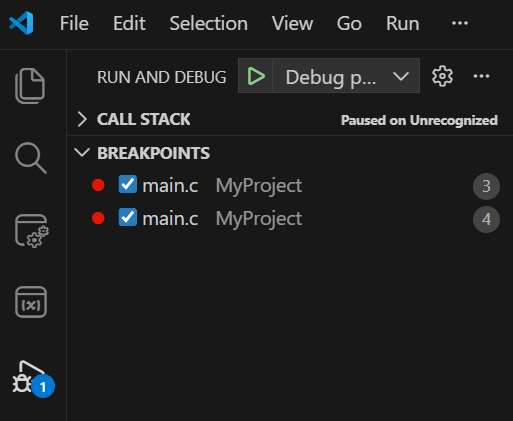
#### Variables View
- In the Variables section of the Run and Debug sidebar:

  - View local, global, and static variables.

- Expand complex variables to see their contents.

- Double-click on a value to edit it.

#### Source View
- The editor displays source code with breakpoints. Click in the gutter to set breakpoints.

#### Watch View
- The Watch section allows adding watch expressions:

  - Add expressions to monitor specific variables or calculations.

  - Right-click on an expression to add it to watch view.

- Add expressions in the Watch section to monitor variables or calculations. Watch expressions are workspace-specific; clear them when switching projects to avoid errors.

#### Inspecting the Stack
- In the Run and Debug sidebar, the Call Stack section shows the current stack frames. Click on a frame to navigate to that location in the source code.

#### Controlling Execution
- Use the debug toolbar controls:

  - Continue (F6): Resume execution.

  - Step Over (F10): Execute current line.

  - Step Into (F11): Step into functions.

  - Step Out (Shift+F11): Step out of functions.

  - Restart: Restart the session.

  - Stop/Disconnect: Terminate the session.

#### Considerations for Attach Process Configurations
- **For attach mode:**

  - Terminate/Stop ends the attached process.

  - Disconnect releases the process without terminating it.

  - Click the “Alt” button to quickly switch between Disconnect and Terminate or choose the desired option from the dropdown menu.

  - Clear breakpoints before disconnecting to avoid warnings.

  - Suspended processes resume automatically on disconnect.

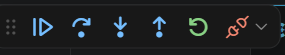
Monitor the Debug Console and Terminal for output and error messages during debugging sessions. For advanced debugging, use Native Inspect commands in the debug console.

#### Setting Breakpoints
- You set and edit breakpoints for Nonstop applications similar to standard VS Code debugging. Click in the gutter next to a line number in the editor to set a line breakpoint. Right-click on a breakpoint for options like conditions or hit counts.
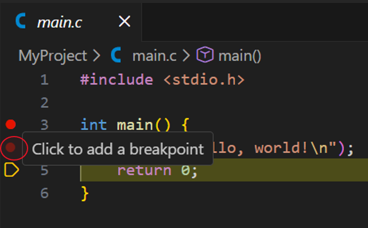
- Setting breakpoints is equivalent to using the Native Inspect break command. Deleting breakpoints is equivalent to using the Native Inspect delete breakpoints command.

- Setting Function breakpoints:

You can also set function breakpoints to pause execution at the entry of a specific function, without needing to know the exact source file or line number.

- Via the VS Code UI: In the Run and Debug view (Ctrl+Shift+D), locate the Breakpoints section in the sidebar. Click the + (Add Function Breakpoint) button. A text field appears — type the function name (for example, myFunction) and press Enter. VS Code will break whenever that function is entered during a debug session.

- Via the Debug Console:You can also set a function breakpoint using the Native Inspect break command in the debug console. These breakpoints will also reflect in the Breakpoint view.

#### Breakpoints View
- The Breakpoints panel in the Run and Debug sidebar shows all breakpoints.

- Nonstop Event Breakpoints trigger on specific events:

  - **Abend**

  - **Stop**

  - **Load** (with optional DLL name)

  - **Unload** (with optional DLL name)

  - Breakpoint properties include:

  - **Enabled**: Toggle breakpoint on/off.

  - **Condition**: Expression that must evaluate to true.

  - **Ignore count**: Number of times to ignore the breakpoint.

  - Breakpoints are workspace-associated and persistent. They can be filtered by process or thread in the breakpoint properties.

> **Note:** : For optimized code, not all local variables may display accurately. Step into functions to update variable values.

## Debugging Nonstop Applications Using Native Inspect (xInspect) Commands

In addition to standard debugging tasks, you can use the Native Inspect (xInspect) console in the Debug Console to enter a limited set of Native Inspect debugging commands. For a list of supported commands, see the Native Inspect Manual.

Breakpoints added, deleted, or modified via commands in the Debug Console are reflected in the Breakpoints panel.

> **Note:** : The extension ignores the Native Inspect configuration file (XINSCSTM on TNS/X). Configure the debugger using the debug configuration dialog only.

### Entering Native Inspect Commands from the Debug Console

- You can enter supported Native Inspect commands in the Debug Console. Commands that assign new values to variables or memory locations update the Variables and Watch view accordingly.

- When breakpoints are created via commands, they appear in the Breakpoints panel.

**Procedure**:

- Open the Debug Console in VS Code.

- Enter commands as you would at a terminal and press Enter.

- The extension does not validate syntax.

## Native Inspect Commands Supported by the Extension

The extension supports the following Native Inspect commands in the Debug Console:

- amap - Display address map information

- break - Set breakpoints (not supported for fractional EDIT line numbers)

- catch load - Break when a DLL is loaded

- catch unload - Break when a DLL is unloaded

- catch stop - Break on stop events

- catch abend - Break on abend events

- delete - Delete breakpoints

- disable - Disable breakpoints

- dmab - Delete memory access breakpoints

- enable - Enable breakpoints

- ih - Display instruction history

- info open - Display open files

- mh - Display memory history

- mab - Set memory access breakpoints

- print - Print variable values (can be used only in the current frame)

- save - Save debugger state

- vq - Quit the debugger

> **Note:** Commands are executed in the Debug Console. The extension does not validate command syntax.

## Detaching the Debugger from a Nonstop Process

To detach the debugger without terminating the process:

- Use the **Disconnect** button in the debug toolbar.

- Clear breakpoints before disconnecting to avoid warnings. Suspended processes resume automatically.

## Ending a Debugging Session

A debugging session ends when:

- The application or process terminates.

- You click **Stop** in the debug toolbar.

- You disconnect from an attached process.

## Debug Configuration Flow

- The Debug Configurations dialog in VS Code allows you to create and manage debug configurations for Nonstop applications.

- You can access this dialog by right-clicking on a project folder in the VS Code Explorer and selecting **HPE Nonstop: Debug Configuration**, or by opening the Command Palette (Ctrl+Shift+P) and selecting **HPE Nonstop: Debug Configuration**.

- **Configuration Mode**

  - **Create New Configuration**: Creates a new debug configuration.

  - **Load Existing Configuration**: Loads an existing configuration from launch.json for editing.

- **Name**

  - Specifies a name for the debug configuration. The default name is generated based on the connection and project (e.g., "Debug connection_name.project_name" for launch mode or "Attach connection_name.project_name" for attach mode).

- **Request Type**

  - **Launch**: Starts a new process for debugging.

  - **Attach**: Attaches to an existing running process.

- **Main Tab**

  - The Main tab specifies project settings, launch type, connection, and remote path or process details.

- **Project Settings**

  - **Nonstop project**: Specifies the project folder containing the executable. Click **Browse** to select a folder.

- **Launch Type**

  - **Nonstop launch type**: Select **Guardian** or **OSS** (default).

- **Connection & Remote Path (Launch Mode)**

  - **Nonstop system**: Select a configured connection from the dropdown. Click **Connect** to test the connection.

- **Nonstop executable's path on Nonstop system**: Enter the full path to the executable on the remote system, or click **Browse** to locate it.

- **Local executable to be transferred to Nonstop path specified above**: Check to transfer a local executable to the remote path. Specify the local file path.

- **Connection & Process (Attach Mode)**

  - **Nonstop system**: Select a configured connection.

  - **Nonstop Process**: Enter the process ID in CPU,PIN format (e.g., 1,123), or click **Browse** to select from running processes.

- **Arguments Tab**

  - The Arguments tab specifies run command options, program arguments, and working directory.

- **Run command options**: Enter options for the run command (e.g., -gpri=149 -cpu=2 for OSS).

- **Program arguments**: Enter arguments to pass to the application.

- **Working directory**: Check to set a custom working directory and enter the path.

- **Environment Tab**

  - The Environment tab sets environment variables or remote files.

  - **Environment variables**: Add variables manually (e.g., `export VAR=value` for OSS).

  - **Environment options**: Use a remote file for environment settings.

- **Debugger Tab**

  - The Debugger tab configures debugger options.

  - **Debugger Settings**: Use the default debugger.

  - **Breakpoint Settings**: Stop at main entry point or a specific function.

  - **Advanced Options**: Enable access to privileged code and data.

- **Source Tab**

  - The Source tab configures source file lookup paths.

  - **Source Lookup Path**: Add rules for finding source files (Local Directory, Local Path Mapping).

  - **Add/Edit/Remove**: Manage source lookup rules.

- **Buttons**

  - **Debug Configuration**: Starts debugging immediately without saving.

  - **Create Debug Configuration**: Saves the configuration to launch.json.

  - Click **Debug** to start debugging immediately without saving.

- **Cancel**: Closes the dialog.


---

# Appendix

## Toolbar Icons

The extension provides various toolbar icons and views for quick access to common operations:

- Nonstop Tools Sidebar

  - The extension adds a Nonstop Tools icon to the VS Code Activity Bar (left sidebar). Clicking it opens the Nonstop Tools view, which provides:

    - Transfer Files Panel

      - Transfer Files from Nonstop: Download files from the connected Nonstop system to your local workspace.

      - Transfer Files to Nonstop: Upload files or folders from your local workspace to the connected Nonstop system.

    - Connections Panel

      - Configure Connections: Click to add, edit, or delete SSH/SFTP connections to Nonstop systems. Displays all configured connections with the following details:

      - Connection Name: User-defined label for the connection.

      - Host Address: The hostname or IP address of the Nonstop system

      - Status Indicator: Shows connection status (connected/disconnected/error)

      - **Quick Actions:** Use the **Connect/Disconnect button** located to the right of the connection name to manage the connection status.

    - Run Configuration Panel

      - Configure Run: Click to create or modify run configurations. Allows you to set up how applications will be launched on the Nonstop system.

      - Run Configurations List: Displays saved run configurations (e.g., "Run MyProject"). Click run button located to the right of the configuration to execute the application with its saved settings.

    - Debug Configuration Panel

      - Configure Debug: Click to create or modify debug configurations.

      - Debug Configurations List: Displays saved debug configurations (e.g., "Debug MyProject”). Click debug button located to the right of the configuration to start a debug session with its saved settings.

- Status Bar

  - At the bottom of VS Code, the extension displays:

    - Connection Status: Shows the currently active connection with a status indicator

    - Green: Connected

    - Red: Disconnected

    - Configure Connections: Click to open the connection configuration dialog

## Content Types

The following table lists the supported file extensions for the languages in the extension:

| Type of file           | Supported extension               |
|------------------------|-----------------------------------|
| C source file          | .c                                |
| C header file          | .h                                |
| C SQL/MX source file   | .ec and .sql                      |
| C++ source file        | .cpp, .cc, .cxx, .c++, .C         |
| C++ header file        | .h, .hh, .hxx, and .hpp           |
| C++ SQL/MX source file | eC, .ecc, .ecpp, .ecxx, and .ec++ |

## Tips on setting up password free logins with Open SSH

This appendix provides tips on setting up both Open SSH on your Windows host and configuring HPE Nonstop SSH on Nonstop servers for passphrase logins. For more information on Open SSH, refer to the man pages for ssh, sftp, ssh-keygen, and ssh-agent. For more information on setting up Nonstop SSH, refer to the *Nonstop SSH Reference Manual*.

The following are general steps for setting up passphrase logins for user ID swdev.doon for the Nonstop system nonstopsystem.corp.net. Substitute your own user ID and system name as appropriate.

1.  On your personal Windows system from a Cygwin shell, generate a public/private key pair using the ssh-keygen command. You'll be asked for a passphrase (twice). The passphrase should be a phrase that you can easily remember. The longer the phrase, the better the security. The passphrase is used when encrypting and decrypting your private key. When asked for a file where the key is to be saved, just hit RETURN to accept the default.

Here is the ssh-keygen command and its output (where XXXXXX represents the passphrase entered):
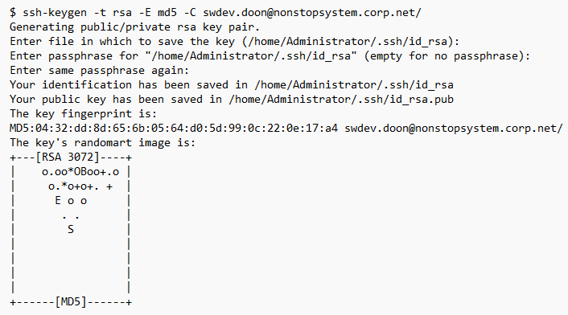
2.  Add your public key on Nonstop servers of interest. This requires running as super.super. If you cannot login as super.super, contact your system administrator.

First, find the SSH process name on the Nonstop server (typically \$ssh0) and open it with sshcom (sample commands are shown below). Use alter user to set your public key. Give it a name (such as key1). You can use that name to delete the public key in the future.

Provide your public key on of two ways. You can provide the fingerprint (which you can get from the output of ssh-keygen above) or you can point SSH at a file containing the public key. (The example below provides the fingerprint.)

Here are sample commands to go to the SSH volume, find the SSH process, and set your public key:

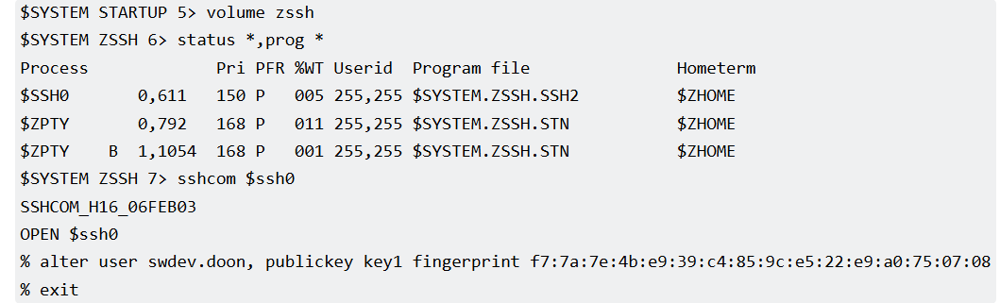If the alter user command complains that it does not know your user ID, then use the add user command.

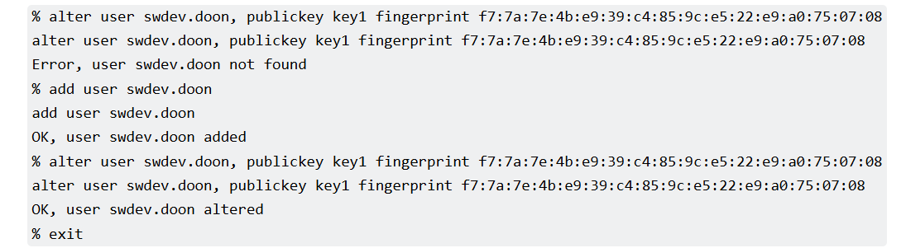
3.  Try connecting to the Nonstop server from a Cygwin shell as in this example:

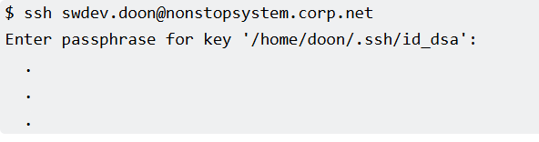
4.  Now try a password free login from a Cygwin shell. First, start ssh-agent:

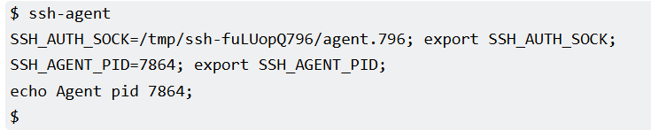

```bash
Export SSH_AUTH_SOCK and SSH_AGENT_PID, then run ssh-add, which prompts you for your passphrase and communicates success to ssh-agent:
```
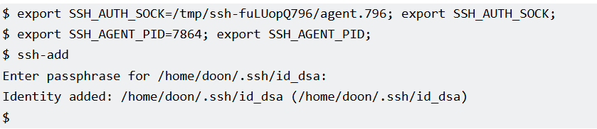
Now try logging on from the same Cygwin shell. You should not be prompted for a passphrase nor a password. Any local processes started as descendents of your current shell can perform password free logins to the remote system since ssh-agent handles the authentication for you.

5.  Using password-free login with the Extension

Once password-free SSH login is configured as described above, the extension uses it automatically when connecting to your Nonstop system. When you configure a remote connection in the extension (via the [Configure Connections page),](#configuring-connections) you provide your SSH private key file path and the associated passphrase. The extension uses these credentials to establish SSH and SFTP sessions for all remote operations — including deploying and running applications, transferring files to and from the Nonstop system, launching debug sessions, and retrieving build output. Because ssh-agent handles authentication in the background, you are not prompted for a passphrase each time the extension performs a remote operation during your development session.

## HPE Nonstop IDE Software for VS Code Configuration

### Configuration Files

The extension uses several configuration files

All the files below reside in .vscode folder:

- launch.json: Stores debug and run configurations

- c_cpp_properties.json: C/C++ IntelliSense configuration

- hpe-nonstop-connections.json: Stores remote connection profiles

- .hpe-nonstop-settings.json: Stores project-specific settings. This file is saved in the project directory (workspace root).

### Commands

The extension contributes the following commands:

- HPE Nonstop: Configure Connections

- HPE Nonstop: Configure Project Settings

- HPE Nonstop: Build Project

- HPE Nonstop: Clean Project

- HPE Nonstop: Run Configuration

- HPE Nonstop: Debug Configuration

- HPE Nonstop: Generate Code Coverage Report

- HPE Nonstop: Deploy Executable

- HPE Nonstop: Transfer Files (to Nonstop)

- HPE Nonstop: Settings (Remote)

- HPE Nonstop: Show Makefile Template

- HPE Nonstop: Transfer Files (from Nonstop)

All commands are accessible via the Command Palette (Ctrl+Shift+P) or by right-clicking on project folders in the Explorer.

### Debug and Run Configuration Types

The extension supports two debug configuration types:

1.  nonstop-run: Run Without Debugging

Runs an application on the Nonstop system without attaching a debugger.

Required:

- connection: Nonstop connection name

- program: Remote executable path

- launchType: guardian or oss

Key Optional:

- transferExecutable, transferFile – deploy executable

- runArgs, programArgs – execution arguments

- cwd – working directory

- envVariables, envFile, inheritEnv – environment setup

- setInitialVolume (Guardian only)

2\. nonstop-ni-debug: Debug Using Native Inspect

Provides full debugging with support for launch and attach modes.

- Launch Mode (start with debugger)

Starts a new process under the debugger.

Required:

- connection, program, launchType

Key Optional:

- All run options (same as nonstop-run)

- useDefaultDebugger, debuggerPath

- stopAtFunction – initial breakpoint

- enablePriv – debug privileged code

- symbolPath – symbol lookup paths

- localPathMapping, localSourceDirectories – source mapping

<!-- -->

- Attach Mode (debug running process)

Attaches debugger to an existing process.

Required:

- connection

- processId (CPU,PIN format)

Key Optional:

- launchType, debugger settings

- stopAtFunction, enablePriv

- symbolPath, source mapping options

Key Difference

Launch: Starts a new process with debugger attached

Attach: Connects to an already running process

Both support breakpoints, stepping, and variable inspection.

### Setting Up Required Tools and Configurations

#### Configure Visual Studio Build Tools
1\. Install Visual Studio Build Tools

- Open the link: <https://code.visualstudio.com/docs/cpp/config-msvc>.

- Navigate to: Prerequisites → Step 3 → Downloads

- Download and install Visual Studio Build Tools from Microsoft (Visual Studio Community)

  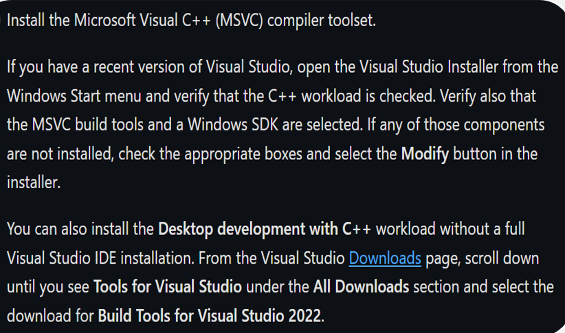

2\. Select Required Workload

- During installation: Choose Workloads → Desktop development with C++ (or equivalent C++ Build Tools workload)

  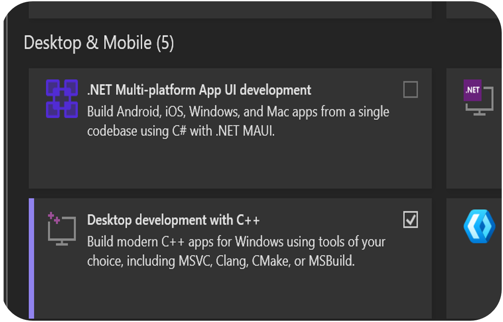

3\. Ensure Required Components

- Make sure the following components are selected:

- MSVC v143 (or latest) C++ x64/x86 build tools

- Windows 11 SDK

  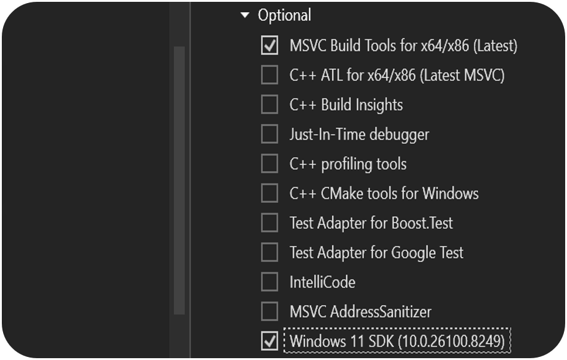

4\. Configure VS Code for MSVC IntelliSense

- Open C/C++ Configuration

- Press Ctrl + Shift + P

- Run: C/C++: Edit Configurations (UI)

- Select Active Configuration

- At the top, choose your configuration (e.g., x64)

- Set Compiler Path

- Locate Compiler Path

- Click Browse

- Select cl.exe from your installation

  - Example path:

  - C:\Program Files\Microsoft Visual Studio\2022\BuildTools\VC\Tools\MSVC\\version\>\bin\Hostx64\x64\cl.exe

- Set IntelliSense Mode

- In IntelliSense mode, choose:

  - windows-msvc-x64

- Save and Apply Changes

- The UI automatically updates your configuration file

  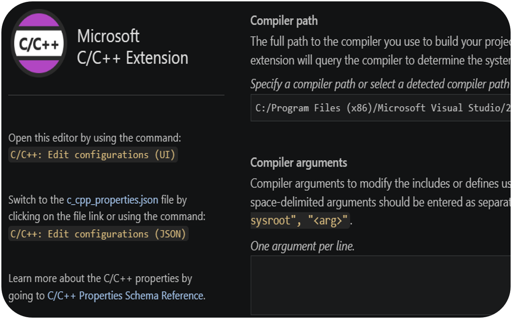

#### Configure Cygwin
- Installing Cygwin: Cygwin provides the \*\*GNU \`make\` utility\*\* on Windows, which is required for VS Code build tasks to compile project sources.

- Installation Steps

  - Download \`setup-x86_64.exe\` from <https://www.cygwin.com> and run it.

  - In the \*\*Choose Installation Type\*\* page, select \*\*Install from Internet\*\* and click \*\*Next \>\*\*.

  - In the \*\*Choose Installation Directory\*\* page, accept the default (\`C:\cygwin64\`) or enter a preferred path, and click \*\*Next \>\*\*.

  - Accept the default local package cache directory and click \*\*Next \>\*\*. Select a download mirror and click \*\*Next \>\*\*. The installer will fetch the package list.

  - In the \*\*Select Packages\*\* page, enter \`make\` in the Search field, expand the \*\*Devel\*\* entry, and click \*\*Skip\*\* next to \*"The GNU version of the 'make utility'"\* to mark it for installation.

  - Click \*\*Next \>\*\*, allow any dependencies to resolve, and wait for installation to complete.

  - Click \*\*Finish\*\*.

<!-- -->

- Post-Installation

  - Add \`C:\cygwin64\bin\` to your Windows \*\*PATH\*\* environment variable so VS Code can locate \`make\`.

  - Open a VS Code terminal and verify the installation: make –version


